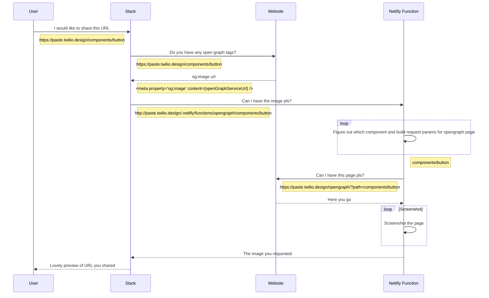

# Open Graph Image Preview Function

When sharing a link to a component page on the internet, we supply a dynamically created [Open Graph](https://ogp.me/) image to be expanded by the service that the link is being shared on. Services can include Twitter and Slack.

**Example:**

## The way it works

