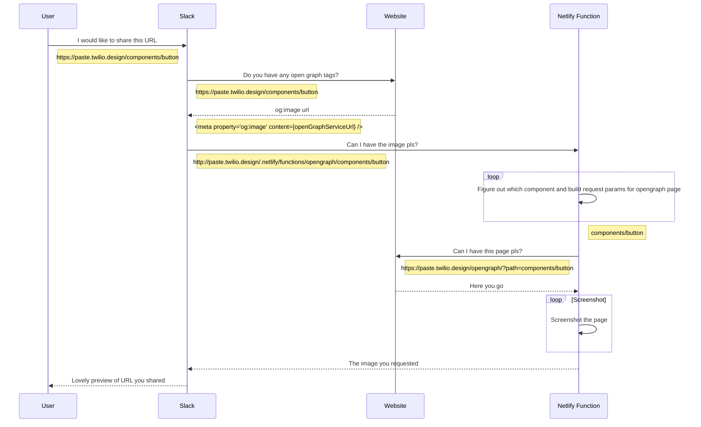

# Open Graph Image Preview Function

When sharing a link to a component page on the internet, we supply a dynamically created [Open Graph](https://ogp.me/) image to be expanded by the service that the link is being shared on. Services can include Twitter and Slack.

**Example:**


## The way it works



## Local development

We use [Netlify CLI](https://docs.netlify.com/cli/get-started/) to run our websites locally. This allows us to run the website and [Netlify functions](https://docs.netlify.com/functions/overview/) in parallel, and Netlify CLI proxy's both to a single port. This makes it feel like to two things are running on the same domain.

To start, run:

```
yarn start:website
```

Once both the website and netlify functions have started running, both will be available on `localhost:8888`.

Once running, the function can be reached at `localhost:8888/.netlify/functions/opengraph/` for testing.

Whilst running, changes to the function code will restart the function with the new code changes applied. (Hot reloading for Node, using Nodemon) This is all handled for us using the Netlify CLI.

The code that generates the opengraph preview page lives in:

- packages/paste-website/functions/opengraph.ts (the function code)
- packages/paste-website/src/pages/opengraph/index.tsx (the code for the UI that is screenshotted)
- packages/paste-website/stories/Opengraph.stories.tsx (a story to aid in local development for the UI)

## Technology / Stack

Netlify Functions are just AWS Lambdas in disguise. They take an incoming request and you can return a response.

Inside our function we use `@sparticuz/chromium` for grabbing the Chrome Browser binary for AWS Lambdas, and puppeteer to run and control the browser.

Using Puppeteer, we instruct Chrome to visit a url on the website, which renders a dynamic page based on the parameters we give it. We then tell puppeteer to use Chrome to take a screenshot of the page, and that image is then returned as the response of the function.

The page on the website renders a box 800px x 420px. The information is display for the component being requested comes from Airtable, via the JS client.

[Winston](https://github.com/winstonjs/winston) does our logging, so we can observe the function running in real time in the Netlify UI.

[Rollbar](https://docs.rollbar.com/docs/aws-lambda) wraps our function and helps log errors to the Rollbar service so we are alerted if it starts to break.
