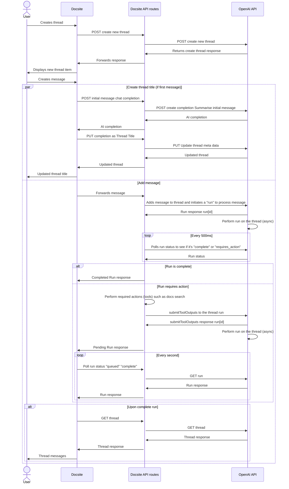

# Paste Assistant

## Overview

The Paste assistant is a UI over the top of the OpenAI API that allows users to create threads and messages. The assistant will then use the OpenAI API to generate completions for the thread and messages. It uses the Assistant API, which comes with the following concepts that make it slightly different from a typical completion API:

- **Assistant**: A modal that contains a collection of conversations between the user and the AI. The assistant can be used to generate multiple completions in a single thread. The assistant has access to "functions" or "tools" (OpenAI naming is variable) which it can choose to call if it needs to perform a specific action to respond to the user. An example might be to search for documentation or to perform a calculation.
- **Thread**: A collection of messages between the user and the AI. The application can add or update a message on the thread. The assistant can add a message to the thread, it does so by performing a "run" on the thread. A run is a process that the assistant uses to generate a response to the thread.
- **Message**: A message is a text based response on a thread. It can have the role of assistant or user.
- **Run**: A run is a process that the assistant performs on the thread to generate a new message response. The run has a number of states such as "queued", "complete" and "requires_action". If a run requires action, the assistant is asking to perform a specific action to generate a response. It will give a list of "tools" it needs the response from, to complete the response run. The run happens asynchronously, does not support streaming, and can take a few seconds to complete.

## Backend

We use a series of API routes to interact with the OpenAI API. The routes are prefixed with `paste-assistant` and use so that the website doesn't directly talk to the OpenAI API. The routes are:

- `api/paste-assistant-messages/[tid].ts`: API endpoint that retrieves and returns messages from a specific thread based on its ID for the Paste Assistant
- `api/paste-assistant-thread/[tid]/run/[rid]/ts`: API endpoint that retrieves and returns a specific run from a given thread based on the thread ID and run ID
- `api/paste-assistant-thread/[tid].ts`: API endpoint that provides functionality to get, update, and delete a thread based on its ID for the Paste Assistant
- `api/paste-assistant-thread/[tid]/index.ts`: API endpoint that creates a new thread via a POST request, notifies a Slack channel about the new thread, and stores the new thread information in a database
- `api/paste-assistant-message.ts`: API endpoint that sends a message to an OpenAI assistant thread, processes the assistant's response, calls a function if requested by the assistant, and returns the output to the assistant for further processing
- `api/paste-assistant-simple-completion.ts`: API endpoint that interacts with the OpenAI's GPT-4 model to provide completions for provided prompts and context

## Sequence Diagram

Below is roughly how the Paste Assistant works. It's a sequence diagram that shows the interactions between the user, the Docsite, the OpenAI API, and the Docsite API routes.

