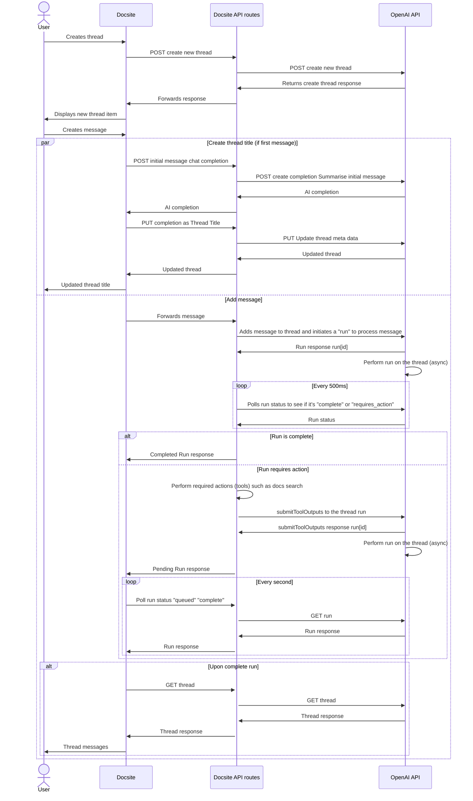

# Paste Assistant

## Overview

## Sequence Diagram

```mermaid
sequenceDiagram
    actor U as User
    participant A as Docsite
    participant API as Docsite API routes
    participant OpenAI as OpenAI API

    U->>A: Creates thread
    A->>API: POST create new thread
    API->>OpenAI: POST create new thread
    OpenAI->>API: Returns create thread response
    API->>A: Forwards response
    A->>U: Displays new thread item
    U->>A: Creates message
    par Create thread title (if first message)
        A->>API: POST initial message chat completion
        API->>OpenAI: POST create completion Summarise initial message
        OpenAI->>API: AI completion
        API->>A: AI completion
        A->>API: PUT completion as Thread Title
        API->>OpenAI: PUT Update thread meta data
        OpenAI->>API: Updated thread
        API->>A: Updated thread
        A->>U: Updated thread title
    and Add message
        A->>API: Forwards message
        API->>OpenAI: Adds message to thread and initiates a "run" to process message
        OpenAI->>API: Run response run[id]
        OpenAI->>OpenAI: Perform run on the thread (async)
        loop Every 500ms
            API->>OpenAI: Polls run status to see if it's "complete" or "requires_action"
            OpenAI->>API: Run status
        end
        alt Run is complete
            API->>A: Completed Run response
        else Run requires action
            API->>+API: Perform required actions (tools) such as docs search
            API->>OpenAI: submitToolOutputs to the thread run
            OpenAI->>API: submitToolOutputs response run[id]
            OpenAI->>OpenAI: Perform run on the thread (async)
            API->>A: Pending Run response
            loop Every second
                A->>API: Poll run status "queued" "complete"
                API->>OpenAI: GET run
                OpenAI->>API: Run response
                API->>A: Run response
            end
        end
        alt Upon complete run
            A->>API: GET thread
            API->>OpenAI: GET thread
            OpenAI->>API: Thread response
            API->>A: Thread response
            A->>U: Thread messages
        end
    end
```
