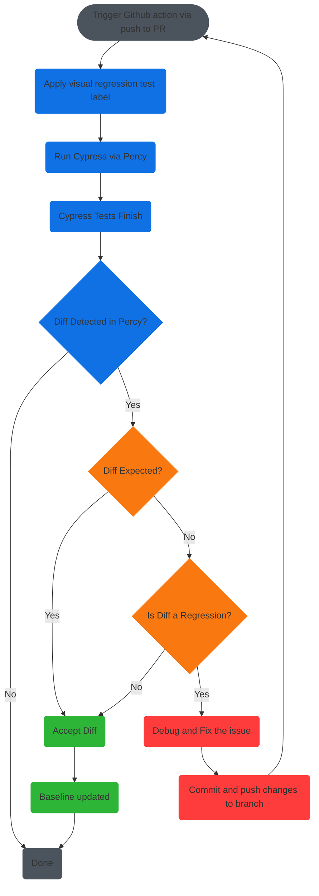

# Visual Regression Testing (VRT)

- [Visual Regression Testing (VRT)](#visual-regression-testing-vrt)
  - [Background](#background)
  - [Getting Started](#getting-started)
    - [Finding the Project Token](#finding-the-project-token)
    - [Add local environment variables](#add-local-environment-variables)
  - [Run locally](#run-locally)
  - [CI workflow](#ci-workflow)
  - [Resources](#resources)
    - [Current configuration](#current-configuration)
    - [Definitions](#definitions)
    - [Helpful links](#helpful-links)

## Background

We have basic infrastructure for running visual regression tests (e.g. VRT) on the [Paste documentation website](https://paste.twilio.design/) using [Percy](https://percy.io/).

We are running these VRT in our current website tests workflow, using [Cypress.io](https://docs.cypress.io/ 'Learn more and view Cypress.io documentation') and [`@percy/cypress`](https://www.npmjs.com/package/@percy/cypress 'Learn more and view percy for Cypress.io documentation').

## Getting Started

Ensure you have access to Percy and that you are added to the `Paste Docsite` project. If you do not have access, please request from one of the team leads.

### Finding the Project Token

1. Log in to your Percy account
2. Go to the Paste Docsite project
3. Go to project settings
4. Copy the key and move on to adding environment variables.

### Add local environment variables

Add the following environment variables to your `.env` file at the root of the monorepo.

```bash
PERCY_TOKEN=__PROJECT_TOKEN__
USE_CYPRESS_VRT=false
```

| ENV variable      | Default           | Description                                                                                 |
| ----------------- | ----------------- | ------------------------------------------------------------------------------------------- |
| `PERCY_TOKEN`     | {{PROJECT_TOKEN}} | This is the Project Token, which you will use only if you need to run the VRT locally.      |
| `USE_CYPRESS_VRT` | `false`           | This controls whether or not the VRT will run. To test locally, change this value to `true` |

## Run locally

Run locally
Ensure that you have all the above required environment variables.

The Percy VRT check runs as a part of our cypress e2e tests.

If `USE_CYPRESS_VRT` is `false`, Percy will not check for visual regressions. The checks currently run programmatically, meaning the tool will only check for regressions if we explicitly instruct the test to do so.

1. In the root `.env` file, update the value of `USE_CYPRESS_VRT` to be `true`
2. Start Cypress.io by running `yarn test:website-gui-percy`
3. Run selected tests by clicking on their names in the GUI

> 👉 **Tip**: In order for changes to the environment variables to take effect, you must re-start cypress. 👈

## CI workflow

Below is a flow chart illustrating possible possible results of the VRT run and actions that should be taken.



## Resources

### Current configuration

This section is _coming soon_.

### Definitions

| Term                      | Description                                                                                                                                                                                               |
| ------------------------- | --------------------------------------------------------------------------------------------------------------------------------------------------------------------------------------------------------- |
| Baseline                  | As Snapshots from current main branch to compare against                                                                                                                                                  |
| Regression                | Introduction of unintended behavior from a change in the source code or configuration.                                                                                                                    |
| Visual regression testing | Comparison of previous and current visual representation of a site or app in a given state; essentially we are evaluating "what users will see" after we implement changes to our source code. (e.g. VRT) |

### Helpful links

- Percy docs
- cypress docs
- gh action info
