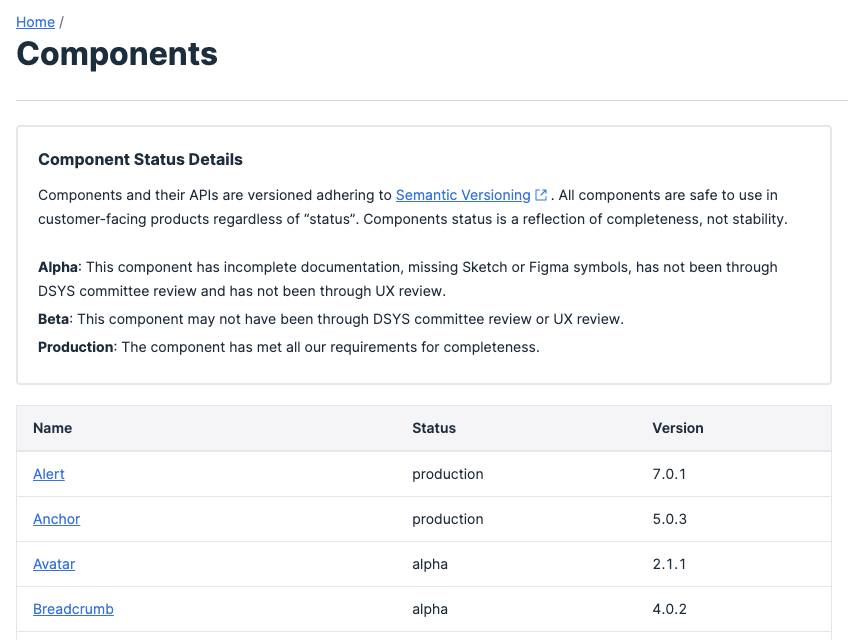
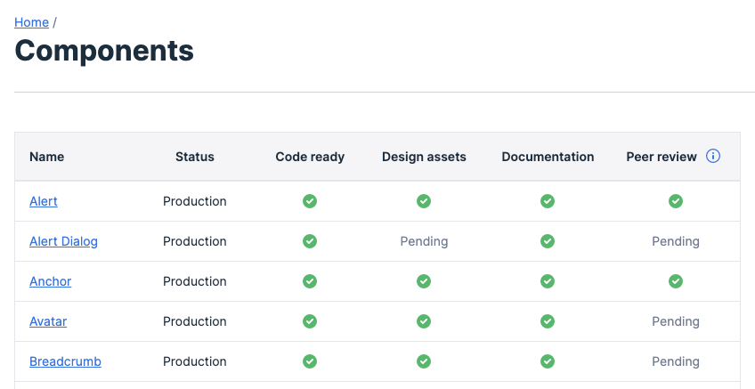

import {graphql} from 'gatsby';
import {Box} from '@twilio-paste/box';

export const pageQuery = graphql`
  {
    mdx(frontmatter: {slug: {eq: "/blog/2021-07-26-pastes-path-to-a-transparent-package-categorization-system/"}}) {
      fileAbsolutePath
      frontmatter {
        slug
        title
        description
        date(formatString: "MMMM D, YYYY")
        machineDate: date
        author
        avatar
        author_link
      }
      headings {
        depth
        value
      }
    }
  }
`;

<ArticleHeader
  title={props.data.mdx.frontmatter.title}
  description={props.data.mdx.frontmatter.description}
  date={props.data.mdx.frontmatter.date}
  machineDate={props.data.mdx.frontmatter.machineDate}
  author={props.data.mdx.frontmatter.author}
  avatar={props.data.mdx.frontmatter.avatar}
  authorLink={props.data.mdx.frontmatter.author_link}
/>

---

<contentwrapper>

<PageAside data={props.data.mdx} hideFeedback />

<ArticleContent>

When integrating a library into a project, you’ll likely want to ensure that it’s a mature and well-maintained library that won’t be deprecated a month down the line. If your project is a customer-facing platform and the library maintains your frontend components, all the more reason to have trust. Transparency between the library and the consumer is integral to building that trust.

## Our previous component maturity system

When we first started releasing packages and documenting them on our website, we wanted to be upfront with our consumers about which components and patterns had design assets, complete docs, been through peer reviews, etc., in an effort to increase transparency. Each one of those steps is essential to creating a complete Paste package. We chose the terms _alpha_, _beta_ and _production_ to differentiate components that were standalone packages of code from ones that had been through more or all steps. Though we emphasized the fact that **all** of our components were stable, the terms _alpha_ and _beta_ still (understandably) caused some confusion.

<contentspacer>

</contentspacer>

While our intention behind choosing _alpha_, _beta_ and _production_ was to use language familiar to engineers and designers, our usage wasn’t consistent with the usage our consumers expected. Typically, in the tech world, _alpha_ and _beta_ refer to software that’s not yet stable. So, it made sense when we noticed a hesitancy toward using (fully mature) components and patterns that weren’t in _production_ status.

## Out with the old, in with the new

We decided it was time for a change. We’re now no longer classifying any of our stable components as _alpha_ or _beta_ - they’re all _production_ status. Ready for use! We are reserving _alpha_ and _beta_ for any experimental components we ship going forward, to indicate that the API could change drastically, and the component itself may even be removed from our library. Using any _alpha_ or _beta_ components will now be considered **high-risk** - not ready for use in production.

Rest assured, all of the components and patterns currently in the system are _production_ status. No need to make any changes on your end - you can keep using all existing components with confidence.

After making the switch to align our definitions of _alpha_, _beta_ and _production_ to indicate level of risk, we needed a way to transparently communicate which steps each component/pattern had completed. Rather than creating a new categorization system, we decided to just, well, tell you. You can now find a checklist of all packages on the [Components Overview](/components) and [Patterns Overview](/patterns) pages, as well as individual package status checklists at the top of each page of documentation.

<contentspacer>

</contentspacer>

Here’s how we define each step:

- **Code ready:** the component or pattern package is published to NPM
- **Design assets:** the component or pattern asset is available in Figma
- **Documentation:** the component or pattern documentation is written and published on the Paste docs site
- **Peer review:** the component or pattern has been reviewed by both design and engineering committee members

## The stability of your product matters!

As long as something is _production_ status, it’s your best choice for a stable UI and a unified customer experience. Because the CX is our first priority and we rely on feedback from the customer (end product user) _and_ the consumer (Paste implementor), our packages are actively maintained. We’re very intentional about how we design our APIs and ship updates. However, being an actively maintained library means that there may, every once in a while, be a breaking change released. When using a _production_ status Paste component, you should feel confident in the stability of the API and the fact that the only time you’ll ever see a breaking change is when it’s _absolutely_ necessary for the customer experience.

Our goal in making this shift was to increase transparency with our consumers in order to improve confidence in our system. It’s because of our mutual communication and the open feedback you share with us that this change was possible. Thanks!

Let us know what you think! If you have any questions or feedback for us, don’t hesitate to reach out (#help-design-system on Slack) or [start a Discussion on Github](https://github.com/twilio-labs/paste/discussions/new).

</ArticleContent>

</contentwrapper>
