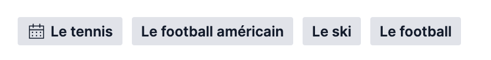
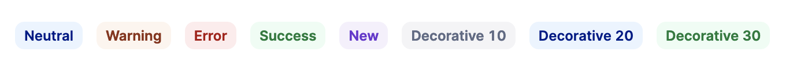
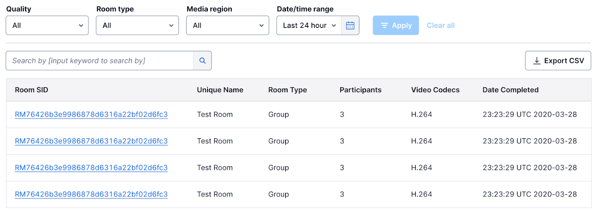
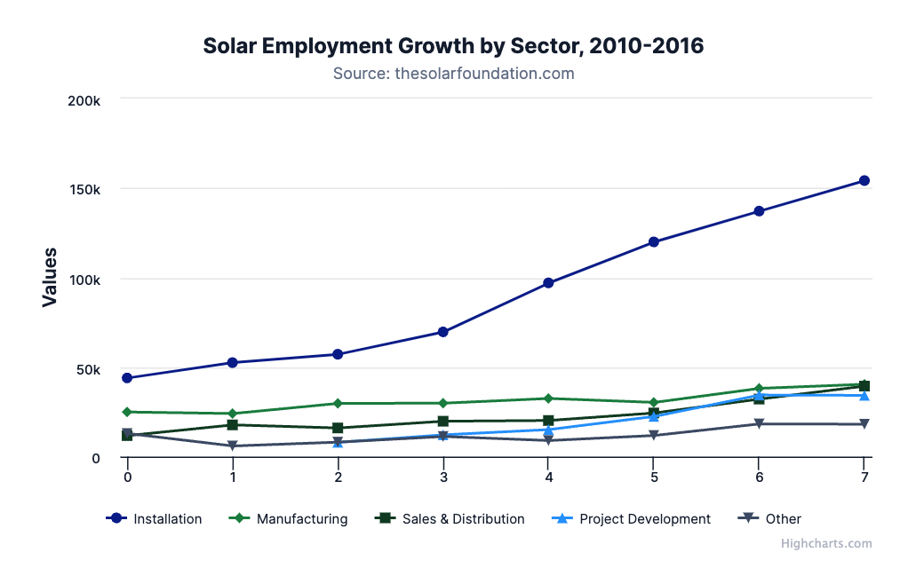

import {graphql} from 'gatsby';
import {Anchor} from '@twilio-paste/anchor';
import {Paragraph} from '@twilio-paste/paragraph';
import {Box} from '@twilio-paste/box';
import {Table, THead, TBody, Tr, Td, Th} from '@twilio-paste/table';
import {UnorderedList, ListItem} from '@twilio-paste/core/list';
import {Callout, CalloutTitle, CalloutText} from '../../components/callout';

export const pageQuery = graphql`
  {
    mdx(frontmatter: {slug: {eq: "/blog/2022-04-06-paste-newsletter/"}}) {
      fileAbsolutePath
      frontmatter {
        slug
        title
        description
        date(formatString: "MMMM D, YYYY")
        machineDate: date
        author
        avatar
        author_link
      }
      headings {
        depth
        value
      }
    }
  }
`;

<ArticleHeader
  title={props.data.mdx.frontmatter.title}
  description={props.data.mdx.frontmatter.description}
  date={props.data.mdx.frontmatter.date}
  machineDate={props.data.mdx.frontmatter.machineDate}
  author={props.data.mdx.frontmatter.author}
  avatar={props.data.mdx.frontmatter.avatar}
  authorLink={props.data.mdx.frontmatter.author_link}
/>

---

<contentwrapper>

<PageAside data={props.data.mdx} hideFeedback />

<ArticleContent>

## 🚀 What's new

### Paste goes international!

To better support Twilio’s global efforts, Paste now supports all P1 languages. This includes a mechanism to swap the font for non-latin character sets, such as Japanese, to get a really crisp UI.

There are some components that need a bit of extra attention when being used for
multiple languages (for example, [Anchor requires an additional prop for i18n](/components/anchor/#internationalization)).
Look for [an "internationalization" example](/components/button/#internationalization) on component docs pages to know whether a given component needs any updates in order to be translated into other languages.

### Paste Dark theme is ready for you!

We are excited to share that the Dark theme is coming out of early preview and is ready for general availability! We incorporated your feedback (buttons are fixed, y’all!), and we brought the Dark theme up to our accessibility and inclusive design standards. The Dark theme improvements are now live on the Paste site, so head on over and switch the toggle in the topmast to “Dark” to check it out.

<Paragraph>
  <Anchor href="/">Check out the Dark Theme</Anchor>
</Paragraph>

### The Badge component enters Stage 2

A big [Badge component](/components/badge/) update improves the look in both the default and dark themes, as well as improving the interactivity for clickable Badges. We’ve also introduced “decorative” variants that can be used for attributes that don’t have a semantic meaning but would still benefit from the visual hierarchy of a Badge.

<Paragraph>
  <Anchor href="/components/badge">Check out the Badge component</Anchor>
</Paragraph>

### Introducing the Filter Group pattern

Many of Twilio’s interfaces involve displaying data in tables.
Some tables are so complex that our users need an easy way to navigate
the data. [Introducing the Filter Group pattern](/patterns/filter-group); with this guidance we
hope to better serve the customer by improving consistency in filtering throughout Twilio products. Thank you to our committee members for working through this complex design challenge with us!

<Paragraph>
  <Anchor href="/patterns/filter-group">Check out the Filter Group Pattern</Anchor>
</Paragraph>

### New Data Visualization foundations

Representing data with visualizations is a tremendous UX
improvement when used appropriately, however it’s a challenge
getting the UI right. Paste is ramping up [guidance and tooling
to make building beautiful and accessible data visualizations](/foundations/data-visualization)
less difficult. Thank you to the Voice & Video team and our committee members for their feedback and care as we work through this problem space.

<Paragraph>
  <Anchor href="/foundations/data-visualization">Check out the Data Visualization Foundations</Anchor>
</Paragraph>

## ⚡ Pastemates™

<em>
  Pastemates are individuals and teams who have been critical contributors to Paste, through advocating for adoption
  within their products and channeling important feedback and contributions back into the system.
</em>

We couldn’t keep it to just one Pastemate this time around; our Pastemates this release are Kate Hsiao, Tess Hannel,
and Zach Kuzmic! This Twilio Segment dream team is leading [UX Infrastructure’s “One Twilio” priority](https://docs.google.com/document/d/1mH5ImzP5Kzb_nVKOHoTksr5jOY0aG6cbqtcEKbFlLYU/edit#bookmark=id.w002x1xn40l) this year, and
they’ve been working tirelessly to pave the way for a unified One Twilio experience across all of our current and future product UI.

They’ve performed audits and gap analyses, written software design docs, and interviewed internal stakeholders on their vision for “One Twilio”, and that’s only the beginning. Their work this year will help to evolve the Twilio product design language and establish the playbook for new companies to adopt Paste as the product design language, to ensure seamless user experiences across all Twilio’s products.

## 🚦 BPM update

<Table>
  <THead>
    <Tr>
      <Th>BPM</Th>
      <Th>Status</Th>
    </Tr>
  </THead>
  <TBody>
    <Tr>
      <Td>
        <strong>🟢 Paste goes international</strong>
      </Td>
      <Td>
        <UnorderedList>
          <ListItem>Paste now fully supports Twilio’s internationalization efforts for Q1.</ListItem>
          <ListItem>
            Paste components are capable of supporting translated content and do not rely on any hard-coded strings.
          </ListItem>
        </UnorderedList>
      </Td>
    </Tr>
    <Tr>
      <Td>
        <strong>🟢 Evolve the Twilio design language to support the vision of “One Twilio”</strong>
      </Td>
      <Td>
        <UnorderedList>
          <ListItem>
            We’re wrapping up our first phase of research for this work (Evergreen gap analysis, ecosystem audit, market
            research, and customer research are nearly complete) and will be moving into concept designs starting in
            April.
          </ListItem>
          <ListItem>
            We’ll be giving a readout of our research during the last week of April; if you’re interested in attending,
            let us know!
          </ListItem>
        </UnorderedList>
      </Td>
    </Tr>
    <Tr>
      <Td>
        <strong>
          🟢 Establish Paste as a leading Next-Gen Monorepo through tooling and infrastructure improvements
        </strong>
      </Td>
      <Td>
        <UnorderedList>
          <ListItem>Made improvements in our build pipeline and testing framework to reduce false negatives.</ListItem>
          <ListItem>Lay the groundwork for our new program management, content, and visual design disciplines</ListItem>
          <ListItem>Work on this priority will start later this year. Stay tuned!</ListItem>
        </UnorderedList>
      </Td>
    </Tr>
    <Tr>
      <Td>
        <strong>
          🟢 Scale Design System onboarding and support for both internal consumers and external customers
        </strong>
      </Td>
      <Td>
        <UnorderedList>
          <ListItem>
            The “onboarding and tooling” survey is underway. Keep an eye out for it and please fill it out when you
            receive it!
          </ListItem>
        </UnorderedList>
      </Td>
    </Tr>
    <Tr>
      <Td>
        <strong>🟢 Build a UI kit for the Twilio Conversations API</strong>
      </Td>
      <Td>
        <UnorderedList>
          <ListItem>
            Design explorations are wrapping up and a couple of our early Chat components have been completed.
          </ListItem>
        </UnorderedList>
      </Td>
    </Tr>
  </TBody>
</Table>

<Box marginBottom="space120" />

## 👀 What's next

<Callout>
  <CalloutTitle>Roadmap delays inbound</CalloutTitle>
  <CalloutText>
    We are observing a Heightened Awareness Period (HAP). As such, the following items may not be released according to
    our initial roadmap projections.
  </CalloutText>
</Callout>

<Table>
  <THead>
    <Tr>
      <Th>Name</Th>
      <Th>Description</Th>
    </Tr>
  </THead>
  <TBody>
    <Tr>
      <Td>
        <strong>Upgrading our CSS framework</strong>
      </Td>
      <Td>
        One of the underpinnings of Paste’s success is our CSS framework (EmotionJS). We are working on updating the
        framework which is a large undertaking as minor discrepancies can occur and need to be caught during our testing
        to not negatively affect customers.
      </Td>
    </Tr>
    <Tr>
      <Td>
        <strong>Releasing Paste design tokens for React Native</strong>
      </Td>
      <Td>
        Providing React-Native developers with Paste’s design tokens will empower consistent, accessible designs across
        platforms.
      </Td>
    </Tr>
    <Tr>
      <Td>
        <strong>Conversations UI Kit</strong>
      </Td>
      <Td>
        We will continue to design and implement a Conversations specific UI Kit featuring design assets and components.
      </Td>
    </Tr>
    <Tr>
      <Td>
        <strong>Token documentation improvements</strong>
      </Td>
      <Td>
        Based on findings from our user research, we will implement improvements to our Tokens page for an enhanced user
        experience.
      </Td>
    </Tr>
    <Tr>
      <Td>
        <strong>Design Multiselect Combobox</strong>
      </Td>
      <Td>Design the Multiselect Combobox component and make design and usability improvements to Combobox overall.</Td>
    </Tr>
    <Tr>
      <Td>
        <strong>Run Onboarding and Tooling survey</strong>
      </Td>
      <Td>Send a survey to internal customers on their experience with Paste onboarding and tooling.</Td>
    </Tr>
    <Tr>
      <Td>
        <strong>Synthesize learnings from One Twilio design language research</strong>
      </Td>
      <Td>
        Synthesize and present learnings from the first phase of “One Twilio” design language research before moving
        into concepting.
      </Td>
    </Tr>
  </TBody>
</Table>

<Box marginBottom="space120" />

## 💼 We're hiring!

We're excited to share that we have two open roles on our UX Infrastructure team.

### Staff Product Designer

We're hiring for a Staff Product Designer role, who will help define and design accessible, easy-to-use, and reusable components, patterns, and services for Twilions and Twilio customers alike. We're looking for someone who has experience working closely with, or on, a design system, component library, or style guide. An ideal candidate for this role is comfortable with ambiguity, passionate about detailed high-quality UI design, and thrives on candid feedback from a diverse set of stakeholders and collaborators.

Take a look at the [job description](https://boards.greenhouse.io/twilio/jobs/3823505), and reach out to Sarah Li with any referrals.

### Staff UX Engineer

Twilio is looking for a Staff UX Engineer to join the UX Infrastructure team. In this role, you will help guide a best-in-class, usable, and inclusive-by-default UX platform, Paste, that helps designers and developers build sophisticated user experiences. Your work will involve leading and collaborating with Engineering and Design teams to build new features and maintain existing ones for our Design System, implementing performance optimizations, and improving upon the infrastructure, tooling, testing, and delivery strategies that give Twilio the confidence to continuously deploy the highest quality software. You’ll be building a critical product and thinking platform-first. You’ll prioritize frequent communication, great documentation, and optimizing for clarity. You’ll be an integral part of creating a UX platform to power the next generation of Twilio’s customer engagement platform, which is used by internal and external Twilio customers.

Check out the [job description](https://boards.greenhouse.io/twilio/jobs/3873421), and reach out to Jade Pennig with any referrals.

See you next time! 👋

— The Design Systems Team

</ArticleContent>

</contentwrapper>
