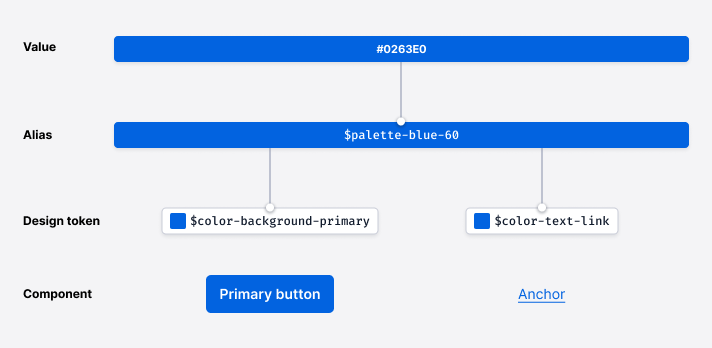

import {graphql} from 'gatsby';

import {Button} from '@twilio-paste/button';
import {Anchor} from '@twilio-paste/anchor';
import {Stack} from '@twilio-paste/stack';
import {DeleteIcon} from '@twilio-paste/icons/esm/DeleteIcon';

import {Callout, CalloutTitle, CalloutText} from '../../../components/callout';
import {DoDont, Do, Dont} from '../../../components/DoDont';
import {ColorSwatch} from '../../../components/color-swatch/ColorSwatch';
import {ColorGradientRainbow} from '../../../components/color-swatch/ColorGradient';
import {SidebarCategoryRoutes} from '../../../constants';

import {
  PrimaryColorExample,
  DestructiveColorExample,
  BackgroundColorSwatches,
  TextColorSwatches,
  BorderColorSwatches,
  StandardPairingSwatches,
  StatusPairingSwatches,
  InversePairingSwatches,
  UseOfColorImgCaption,
  TokensDiagramImgCaption,
  InteractingStatesImgCaption,
} from '../../../component-examples/ColorsFoundationExamples';

export const pageQuery = graphql`
  {
    mdx(frontmatter: {slug: {eq: "/foundations/colors/"}}) {
      fileAbsolutePath
      frontmatter {
        slug
        title
      }
      headings {
        depth
        value
      }
    }
  }
`;

<content>

<ComponentHeader
  name={props.pageContext.frontmatter.title}
  description={props.pageContext.frontmatter.description}
  categoryRoute={SidebarCategoryRoutes.FOUNDATIONS}
/>

</content>

---

<contentwrapper>

<PageAside data={props.data.mdx} />

<content>

## Introduction

Color is a powerful brand identifier that helps provide contrast and define hierarchy to guide our users’ attention. Color should be used boldly, but not excessively. Our color palette maintains unity across all Twilio properties, from marketing to product design.

Paste’s color system is designed with brand personality, usability, and accessibility in mind. Additionally, our color system’s decisions align our products to our product traits: Clean, Professional, and Neighborly.

<ColorGradientRainbow />

## Product traits

### Clean

Paste aims to help create modern experiences that cut out the clutter and create focus for the users’ tasks at hand. Therefore, our colors should be used to establish hierarchy and balance, emphasizing important actions to take or information users should know. Colors should support a harmonious experience and not compete with each other.

### Professional

Though Twilio’s brand is friendly in nature, we also strive to exude professionalism within our UIs. For example, our customers use Twilio to build applications for healthcare professionals, they want to use a product they can trust. Color should be used to establish consistency, ensure accessibility, and communicate meaning.

### Neighborly

We bring in color to celebrate key moments to give our UIs a neighborly feel. For example, this can happen with illustrations used in onboarding and empty states or when a user has successfully completed an important task.

## Color system

Colors in Paste are built on aliases and design tokens. Tokens abstract values to attach a meaning to their intended usage. Paste’s design tokens point to an alias to define their color, while the aliases point to hex codes or RGB values.

### Color aliases

Paste’s color aliases are the primitive form of the colors in our palette. They act as an “alias” for the true hex code or RGB value of each of our colors and are referenced by our design tokens. Each of our colors currently has a minimum of 10 identified “steps”, with the opportunity to add new ones as needed. Lower steps appear lighter in color and higher steps appear darker in color.

### Color design tokens

Design tokens represent fundamental decisions of Paste’s design language, specifying their intended usage with their semantic naming in a predictable and clear way. All of Paste’s design tokens reference our aliases, and all Paste components and primitives use design tokens. Aliases are never directly used in the implementation of Paste UI; only tokens can be used.

To learn more about design tokens, [check out our Tokens Overview](/tokens/).

<TokensDiagramImgCaption />

## Color tokens

### Background colors

Background color tokens define the background colors used in many of Paste’s UI components and elements.

<BackgroundColorSwatches />

[View all background color tokens](/tokens/list/#background-colors)

### Text and icon colors

Text color tokens are used to define text and icon colors. We’ve created a set of accessible text color tokens to promote legibility and readability to be used on dark and light backgrounds.

We specifically have `color-text-*` and `color-text-icon-*` tokens, since icons have different contrast requirements. Since they are graphical objects, they only need to meet a 3:1 color contrast ratio, as opposed to text, which must meet 4.5:1. This means that icons can use any `color-text-*` or `color-text-icon-*` token, but text should never use `color-text-icon-*` tokens.

<TextColorSwatches />

[View all text and icon color tokens](/tokens/list/#text-colors)

### Border colors

Border color tokens define the color of borders, as seen in toasts, alerts, cards, checkboxes, radio buttons, and more.

<BorderColorSwatches />

[View all border color tokens](/tokens/list/#border-colors)

## Usage

### Recommended color pairings

Not all text or icons tokens will be accessible on all background tokens in Paste. When composing UIs, ensure color pairings meet accessibility guidance. Here are some general color pairings that have been designed for and tested for accessible contrast ratios:

The standard text and icon color tokens (`$color-text`, ` $color-text-weak`, `$color-text-icon`) are meant to be used on the standard background color tokens (`$color-background` and `$color-background-body`).

<StandardPairingSwatches />

Status text and icon color tokens are designed to be accessible on the standard background color tokens and on the weakest variant of the corresponding status background color token. For example, `$color-text-success` can be used on top of `$color-background-success-weakest`. `$color-text` can also be used on the weakest variant of all status background color tokens.

<StatusPairingSwatches />

The inverse text and icon color tokens (`$color-text-inverse`, `$color-text-inverse-weak`, `$color-text-icon-inverse`) are meant to be used on the inverse background color tokens (`$color-background-inverse` and `$color-background-body-inverse`).

<InversePairingSwatches />

### Brand colors

Paste uses Twilio’s brand colors intentionally and sparingly. Twilio Red is reserved for moments of impact like in illustrations, logos, or iconography, as our products’ environments need a subdued brand presence and a more focused experience. [Learn more about color distribution from the Twilio brand guidelines](https://www.twilio.com/brand/elements/colorresources#Color_distribution).

### Primary interactive colors

For primary interactive elements, like buttons and links, we use blue colors to help differentiate between interactive and non-interactive UI elements.

<LivePreview scope={{Stack, Button, Anchor}}>{PrimaryColorExample}</LivePreview>

### Destructive interactive colors

For interactive elements that connote a destructive action, such as deleting an object, we use red colors. This is used to inform users of the possible consequences of deleting or removing something within the UI.

<LivePreview scope={{Stack, Button, DeleteIcon}}>{DestructiveColorExample}</LivePreview>

### Statuses

#### Error

Paste uses red to draw attention to critical errors. Red is an alarming color and should be used with care as it can convey a negative feeling. Error tokens are used in components and patterns such as alerts, toasts, buttons, badges, form elements, and statuses.

#### Success

Paste uses green to indicate success states. Green is a vibrant color and should be used sparingly to convey a positive feeling. It’s currently used with alerts, toasts, badges, form elements, and statuses.

#### Warning

To indicate to a user that an issue can be avoided or needs a corrective action, Paste uses orange for its warning tokens. Warning tokens are used with alerts, badges, toasts, and statuses.

#### Neutral

Paste uses blue to indicate neutral information or a neutral state to a user. Blue is a calming color that does not typically cause alarm in a user experience. Neutral tokens are used with alerts, toasts, badges, and statuses.

### Color themes

Paste is a themable system. Themes are collections of design tokens that reference specific values. Paste has a Default Theme, as well as a Dark Theme in early preview. Choose which themes to use based on content and user experience needs.

If you’re looking to create a new or custom theme, [check out our theme documentation](/customization/creating-a-custom-theme).

#### Default theme

Paste, by default, uses the design language that was specifically designed to unify all Twilio products, known as the Default Theme. It’s currently the standard for almost all Twilio products.

#### Dark theme

Paste also has a Dark theme that can be leveraged to enable dark mode within products. This, however, relies on full Paste adoption in a product. If there are parts of the UI that aren’t using Paste, Dark theme wouldn’t be applied and the result will be a broken and inconsistent UI. For more questions, [join our discussion on GitHub](https://github.com/twilio-labs/paste/discussions/1527).

### Colors in illustrations

For any illustration needs, refer to [the Twilio Brand guidelines](https://www.twilio.com/brand/elements/illustration-guidelines).

### Data visualization

Coming soon!

### Do’s and Don’ts

<DoDont>
  <Do title="Do" body="Use Paste’s color design tokens to craft your UI." />
  <Dont
    title="Don't"
    body="Avoid using or creating custom colors whenever possible, and do not use aliases directly. Need a new color token? Start a GitHub discussion."
  />
</DoDont>

<DoDont>
  <Do title="Do" body="Ensure color choices and pairings meet the minimum WCAG AA color contrast ratio requirements." />
  <Dont title="Don't" body="Don’t use inaccessible color pairings." />
</DoDont>

<DoDont>
  <Do
    title="Do"
    body="Use primary interactive colors intentionally to indicate the most prominent action a customer would take on a screen."
  />
  <Dont
    title="Don't"
    body="Don’t overuse primary interactive colors (e.g. using several primary buttons next to each other). This disrupts the visual hierarchy and focus of the most important actions on a screen for the user."
  />
</DoDont>

<DoDont>
  <Do
    title="Do"
    body="Use color along with another visual element (like an underline, border width change, a text label, etc.) when conveying meaning within a UI."
  />
  <Dont title="Don't" body="Don’t use color alone to convey meaning." />
</DoDont>

<DoDont>
  <Do
    title="Do"
    body="When designing in Figma, use the Default Theme Color Styles library. This helps attribute the correct color style to use for a better design/engineering hand-off. E.g. use the “text/text-color” color style for body copy text."
  />
  <Dont
    title="Don't"
    body="Don’t use hex codes or other hard-coded values whenever possible in Figma. Using colors not defined by the color styles could further separate the design from the eventual codified experience, making it more difficult during hand-offs between designers and engineers."
  />
</DoDont>

## Accessibility

One of our core design principles for Paste is [“It’s Inclusive”](/introduction/about-paste/#its-inclusive). We strive to use and pair colors that are accessible for all users, including those with low vision. The color palette and guidelines conform to [Web Content Accessibility Guidelines 2.1](https://www.w3.org/TR/WCAG21/) (WCAG) AA standards, an industry standard and legal guideline set from [section 508](https://www.section508.gov).

When choosing colors, they should be able to be seen by all kinds of users, including those with low vision. Learn more about inclusive design via [our Inclusive Design Guide](/inclusive-design).

### Tools

It’s important to ensure that colors meet the desired color contrast ratios to be not only conformant to the WCAG guidelines, but accessible. You can use the following tools to test color contrast ratios:

- [Are my colors accessible?](https://www.aremycolorsaccessible.com/)
- [Web Aim color contrast checker](https://webaim.org/resources/contrastchecker/)
- [Figma Stark Plugin](https://www.figma.com/community/plugin/732603254453395948/Stark)

### WCAG Guidelines + Color

Paste’s color palette and guidelines aim to meet [Web Content Accessibility Guidelines 2.1](https://www.w3.org/TR/WCAG21/) (WCAG) AA standard contrast ratios of conformance. In the sections to follow, we’ve summarized the WCAG guidance on using color to help you build accessible UIs.

### Text contrast

As detailed in [WCAG Success Criterion 1.4.3 (Level AA)](https://www.w3.org/TR/WCAG21/#contrast-minimum), the color contrast ratio of text against its background must be at least 4.5:1. This includes all text in active UI controls, including placeholder text.
The exceptions are:

- Bold text at 18px or larger can be 3:1 against its background
- Text at 24px or larger, in any weight, can be 3:1 against its background

The following have no contrast requirements:

- Text that is part of a logo or brand name
- Text inside user interface controls that are disabled or inactive

### Graphical objects contrast

As detailed in [WCAG Success Criterion 1.4.11 (Level AA)](https://www.w3.org/TR/WCAG21/#non-text-contrast), graphics and parts of graphics—such as charts, illustrations, and icons—must have a contrast ratio of 3:1 against adjacent colors.

The following have no contrast requirements:

- Photos or real life scenes
- Logos
- When a graphic’s current form is essential to the information it is conveying and changing it to meet contrast requirements would remove its true representation

### Use of color

As detailed in [WCAG Success Criterion 1.4.1 (Level A)](https://www.w3.org/TR/WCAG21/#use-of-color), it is important not to use color alone as a means of conveying information, indicating an action, prompting a response, or distinguishing a visual element. Instead, convey such information with text and/or iconography, and use color only as a means to further enforce the meaning.

<UseOfColorImgCaption />

### User Interface controls

As detailed in [WCAG Success Criterion 1.4.11 (Level AA)](https://www.w3.org/TR/WCAG21/#non-text-contrast), the intent of this success criterion is to ensure that active user interface controls—such as buttons and form controls—and meaningful graphics are distinguishable by people with moderately low vision.

- Active UI Controls must use a color that is 3:1 against adjacent colors to be identified as interactive, including interaction states like focus and hover.
  - If a control contains text that passes text color contrast, then it can be identified by the text alone. For example, if a button is designed with text and a border, and the text meets color contrast requirements, then the border does not need to be 3:1.
  - If a control contains no text, then its bounding box must meet color contrast requirements. For example, if a text input has no content within it, the border must meet 3:1.
- If color alone is used for focus, hover, or active indicators: the indicator must meet 3:1 against adjacent colors and meet 3:1 against the previous state.
  - If you just change the background color, the new background must be 3:1 against adjacent colors and the previous background color.
  - If you change the physical shape, i.e. adding a shadow, the shadow must meet 3:1 against adjacent color.
  - If you change the physical attributes outside of color alone, e.g., underline the text, color contrast requirements for the control is exempt.

<InteractingStatesImgCaption />

<Callout>
  <CalloutTitle as="h4">Still need more guidance?</CalloutTitle>
  <CalloutText>
    This guideline has many exceptions and rules, so it can get complicated. The information provided is an attempt to
    cover most cases, but doesn’t cover everything.{' '}
    <Anchor href="https://www.w3.org/WAI/WCAG21/Understanding/non-text-contrast.html">
      Learn more about WCAG’s non-text contrast guidelines
    </Anchor>
    .
  </CalloutText>
</Callout>

</content>

</contentwrapper>
