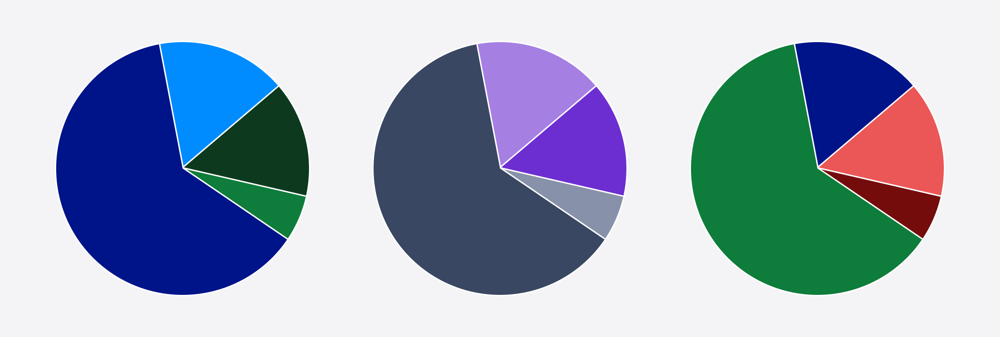
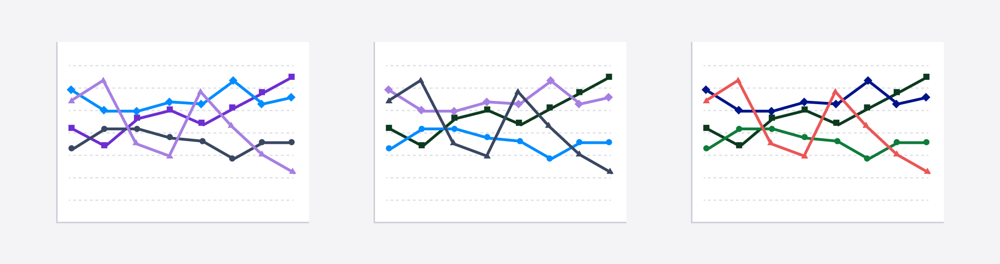

import {graphql} from 'gatsby';
import {GatsbyImage} from 'gatsby-plugin-image';

import Highcharts from 'highcharts';
import HighchartsReact from 'highcharts-react-official';
import {usePasteHighchartsTheme} from '@twilio-paste/data-visualization-library';

import {Box} from '@twilio-paste/box';
import {Heading} from '@twilio-paste/heading';
import {Text} from '@twilio-paste/text';

import {Callout, CalloutTitle, CalloutText} from '../../../components/callout';
import {SidebarCategoryRoutes} from '../../../constants';
import {
  LineChartExample,
  LineChartOptions,
  DataVizColorSwatches,
  PieChartCaption,
  LineChartCaption,
} from '../../../component-examples/DataVisualizationExamples';

export const pageQuery = graphql`
  {
    figmaColors: file(
      sourceInstanceName: {eq: "assets"}
      relativePath: {eq: "images/foundations/data-visualization/figma-colors.png"}
    ) {
      childImageSharp {
        gatsbyImageData(layout: FULL_WIDTH)
      }
    }
    mdx(frontmatter: {slug: {eq: "/foundations/data-visualization/"}}) {
      fileAbsolutePath
      frontmatter {
        slug
        title
      }
      headings {
        depth
        value
      }
    }
  }
`;

<content>

<ComponentHeader
  name={props.pageContext.frontmatter.title}
  description={props.pageContext.frontmatter.description}
  categoryRoute={SidebarCategoryRoutes.FOUNDATIONS}
/>

</content>

---

<contentwrapper>

<PageAside data={props.data.mdx} />

<content>

## Introduction

This foundation page was created to help establish a familiar and accessible user experience when interacting with data visualization across all Twilio products. These recommendations should enable you to tell accurate and convincing stories around data in a visually consistent and accessible manner.

## Getting started

### For engineers

The easiest way to use the data visualization tokens in your charts is to use `usePasteHighchartsTheme` from the [data visualization library package](/core/libraries/data-visualization) with [Highcharts](https://www.highcharts.com/). The `usePasteHighchartsTheme` hook takes an object of Highchart configurations and returns a new object with Paste colors and fonts.

<LivePreview scope={{Highcharts, HighchartsReact, usePasteHighchartsTheme, LineChartOptions}} language="jsx" noInline>
  {LineChartExample}
</LivePreview>

### For designers

To get started incorporating our data visualization design tools into your own Twilio customer experiences and prototypes, please visit our [Design Guidelines for Paste](/introduction/for-designers/design-guidelines).

The [color palette](#color-palettes) used for data visualizations are available as color styles in both the [Default Theme](https://www.figma.com/file/OZKRQFOkOAl413m5JVIYE6/Paste-Default-Theme) and [Dark Theme](https://www.figma.com/file/TZMBaCxXkX8u5aVRVYboid/Paste-Dark-Theme?node-id=0%3A1) libraries.

<Box maxWidth="size30" paddingBottom="space110" marginX="auto">
  <GatsbyImage image={props.data.figmaColors.childImageSharp.gatsbyImageData} />
</Box>

## Color palettes

The color palette for data visualizations is a select subset of the Paste Unified Design Language color palette. It is designed to maximize accessibility and harmony within a page.

In the following sections, we’ll detail each palette we recommend using for your data visualizations and how you should be using them. You can also reference all the data visualization color palettes on our [Design Tokens page](/tokens).

### Categorical

Categorical (or qualitative) palettes ​​are derived from colors of different hues but uniform saturation and intensity. They help users visualize unrelated data points of completely dissimilar origin or unrelated values. An example of a categorical palette is use is [this visualization of different ethnicities in New York City](http://archive.nytimes.com/www.nytimes.com/interactive/2011/01/23/nyregion/20110123-nyc-ethnic-neighborhoods-map.html?_r=0). There is no correlation between the data for different ethnicities and a categorical palette is therefore used here.

An example of a non-categorical palette would be a sequential color palette (although we don’t yet have this type of color palette available), which is composed of varying intensities of a single hue of color at uniform saturation. An example of this would be [this monthly state retail sales visualization](https://www.census.gov/library/visualizations/interactive/monthly-state-retail-sales.html). The same hue is used to create a correlation between the different monthly retail sales data points that were recorded in each state.

The categorical palette is fully 3:1 contrast-accessible against our `$color-background-body` token and has >2:1 contrast between neighboring colors. Since the contrast between neighboring colors falls short of the [WCAG 2.1 AA requirement for non-text](https://www.w3.org/WAI/WCAG21/Understanding/non-text-contrast.html) contrast, we will also include color-agnostic accessibility recommendations to assist with data read, which will be detailed in [additional accessibility for charts](#additional-accessibility-for-charts) section.

<Callout>
  <CalloutTitle as="h3">Be mindful about how you apply this palette.</CalloutTitle>
  <CalloutText>
    The colors of this palette should be applied in sequence strictly as described. The sequence is carefully curated to
    maximize contrast between neighboring colors to help with visual differentiation. You can start anywhere in the
    sequence, but be sure to follow the remaining order (i.e. You can start with 5, as long as you use the rest of the
    sequence in order: 6, 7, 8, 9, 10, 1, 2, 3, 4).
  </CalloutText>
</Callout>

<DataVizColorSwatches />

## Chart anatomy

Each element included in a chart plays an important role in data communication. In this section we’ll provide recommendations on how to style and locate the auxiliary elements such as chart titles, axis titles, legends, etc. More detail will be provided soon!

## Chart guidelines

Choosing the most appropriate chart type is critical in telling the most convincing stories around data. In this section we’ll be providing recommendations on which charts to use and when. More detail will be provided soon!

## Additional accessibility for charts

### Divider lines

Although we’ve ensured that the recommended [data visualization colors](#color-palettes) are 3:1 accessible against the background, it’s not possible to keep them 3:1 accessible against each other at the same time. So for charts that are using the categorical palette, we recommend using a divider line to separate any touching colors which also help to differentiate between categories.

An example showing the use of divider lines is [this pie chart categorizing the race diversity index in the U.S. from the 2010 census data](https://www.census.gov/content/dam/Census/newsroom/blogs/2021/rsblog-meauring-race-ethnic-diversity-2020-census/rsblog-measuring-race-ethnic-diversity-2020-census-figure4.jpg). A white divider line is used to create contrast and help distinguish the difference between the categories.

<PieChartCaption />

### Shapes

Shapes can also be used in combination with color-coded data points. Using shapes in addition to color adds another layer of differentiation so that charts are not relying solely on color to communicate meaning.

<LineChartCaption />

</content>

</contentwrapper>
