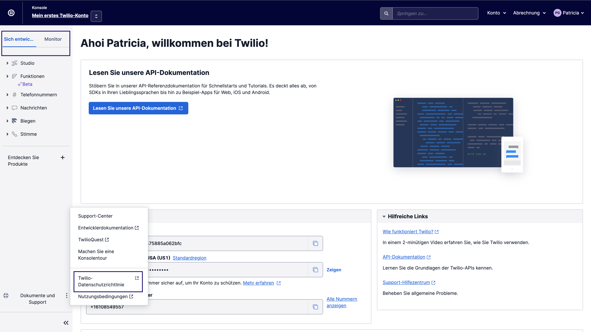
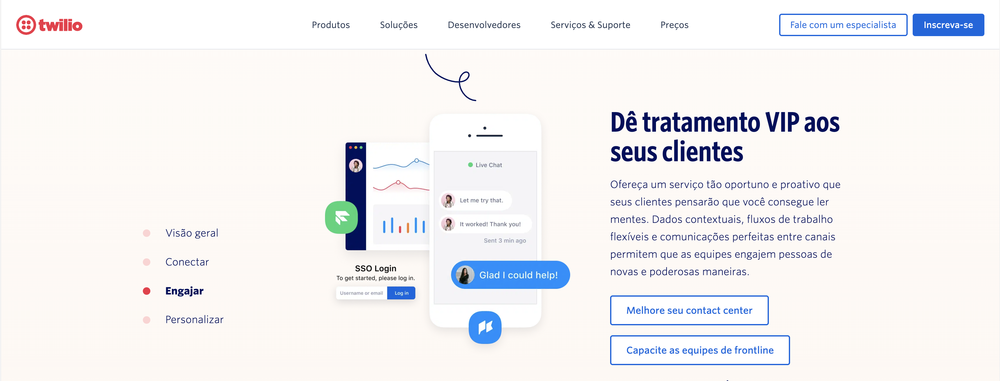

import {graphql} from 'gatsby';

import {Callout, CalloutTitle, CalloutText} from '../../../components/callout';

import {SidebarCategoryRoutes} from '../../../constants';

export const pageQuery = graphql`
  {
    mdx(frontmatter: {slug: {eq: "/foundations/localization/"}}) {
      fileAbsolutePath
      frontmatter {
        slug
        title
      }
      headings {
        depth
        value
      }
    }
  }
`;

<content>

<ComponentHeader
  name={props.pageContext.frontmatter.title}
  description={props.pageContext.frontmatter.description}
  categoryRoute={SidebarCategoryRoutes.FOUNDATIONS}
/>

</content>

---

<contentwrapper>

<PageAside data={props.data.mdx} />

<content>
<Callout>
  <CalloutTitle>Have more questions?</CalloutTitle>
  <CalloutText>
    This page contains general guidance around best practices for localization. If you are a Twilion and have any questions, please
    visit the{' '}
    <Anchor href="https://internal-product-docs.twilio.com/docs/internationalization/">Global team's product docs</Anchor>, or contact them on Slack at #help-localization.
  </CalloutText>
</Callout>

## Introduction

Self-service tips on how to build experiences in a way that's appropriate and meaningful to all our customers, no matter where they are in the world.

### Definition of terms

#### Internationalization

Internationalization is the design and development of a product or interface that enables easy localization for target
audiences that vary in culture, region, or language.

#### Localization

Localization refers to the adaptation of a product or interface to meet the language, cultural and other requirements
of a specific target market/locale.

#### Translation

Converting text from one language to another. Not to be confused with localization, translation is just one part of
localizing a product.

#### Locale

A linguistic region defined by both its language and country. Please note that languages and countries won't always
have a 1:1 mapping.

| Linguistic region | Language   | Country |
| ----------------- | ---------- | ------- |
| fr-FR             | French     | France  |
| fr-CA             | French     | Canada  |
| pt-Brazil         | Portuguese | Brazil  |

## General guidelines

Continue reading to learn how to build experiences in a way that's appropriate and meaningful to all our customers, no matter where they are in the world.

### Leave blank space around condensed UI components

- Leave blank space around condensed UI components, such as popovers, buttons, and tabs to prevent unexpected line breaks.
  - For some languages, text is up to 30% longer on average than English.
- If text gets truncated or has line-breaks at wrong places could lead to grammatical errors and design breaks.
- Make all UI components expandable (auto-layout).
- Don't assign fixed-width or height to UI components, unless there's a compelling reason.

### Order in components matter

Avoid creating UI sentences. If the layout and functionality of your interface is dependent on a certain word order, it's likely to break when localized.
[Learn more here](https://paste.twilio.design/components/label/#about-label 'Learn more about how how to design layout and functionality that is resilient when localized.').

### Avoid forced capitalization

- Avoid setting a single capitalization design rule that fits all languages.
  - In French, Italian, and Spanish (among others) only the first letter should be capitalized for certain words.
  - In German (P1), certain types of nouns, gerunds, and names must start with upper-case.
- Developers should avoid using CSS, _e.g._ `text-transform: capitalize;` to handle capitalization.

### Avoid flags to represent languages

- Use flags only to represent countries and not to represent languages.
- Always write the name of the language instead of using a flag.

### Avoid text on images

- If text over images is needed, overlay it by code, using HTML and CSS.

</content>

</contentwrapper>
