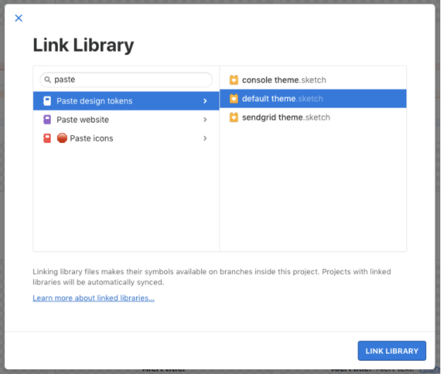
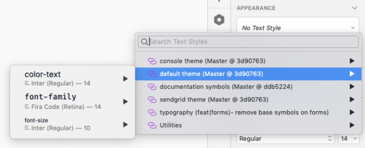
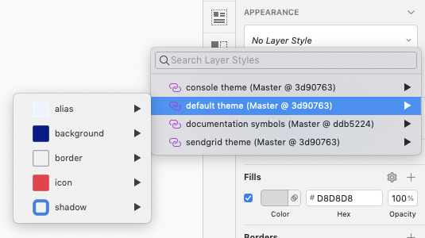
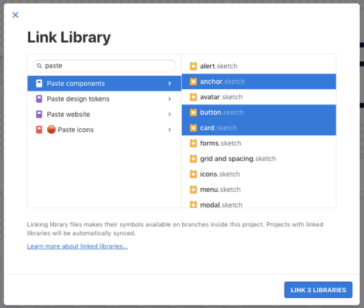
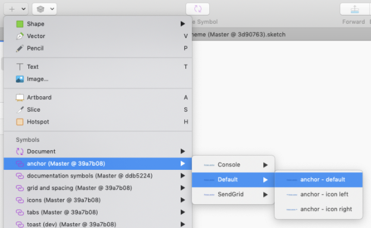
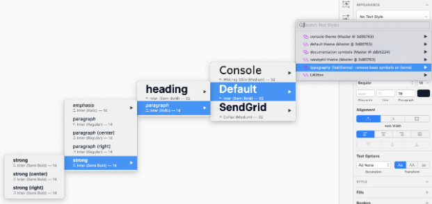
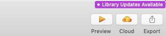
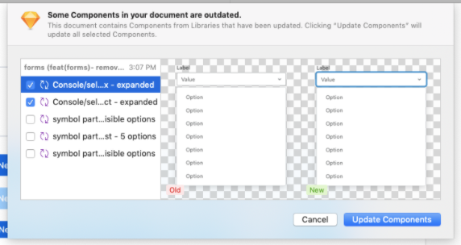
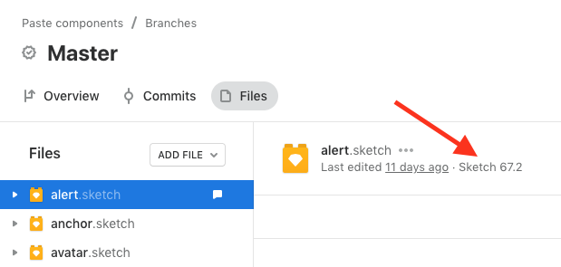

import {graphql} from 'gatsby';
import {Anchor} from '@twilio-paste/anchor';
import {Box} from '@twilio-paste/box';
import {Text} from '@twilio-paste/text';
import {Paragraph} from '@twilio-paste/paragraph';
import {Card} from '@twilio-paste/card';
import {Tooltip} from '@twilio-paste/tooltip';
import {Flex} from '@twilio-paste/flex';
import {version as typesVersion} from '@twilio-paste/types/package.json';
import {version as stylePropsVersion} from '@twilio-paste/style-props/package.json';
import {version as designTokensVersion} from '@twilio-paste/design-tokens/package.json';
import {version as themeVersion} from '@twilio-paste/theme/package.json';
import {version as coreVersion, dependencies as coreDependencies} from '@twilio-paste/core/package.json';
import {version as iconsVersion} from '@twilio-paste/icons/package.json';
import {version as animationVersion} from '@twilio-paste/animation-library/package.json';
import {version as stylingLibraryPropsVersion} from '@twilio-paste/styling-library/package.json';
import {version as dropdownVersion} from '@twilio-paste/dropdown-library/package.json';
import {version as reakitVersion} from '@twilio-paste/reakit-library/package.json';
import {Callout, CalloutTitle, CalloutText} from '../../../components/callout';
import {InlineCode} from '../../../components/Typography';
import Package from '../../../../../../package.json';

import { SuccessIcon } from "@twilio-paste/icons/esm/SuccessIcon";
import { WarningIcon } from "@twilio-paste/icons/esm/WarningIcon";
import { ErrorIcon } from "@twilio-paste/icons/esm/ErrorIcon";

export const pageQuery = graphql`
  {
    mdx(fields: {slug: {eq: "/getting-started/design/"}}) {
      fileAbsolutePath
      frontmatter {
        slug
        title
      }
      headings {
        depth
        value
      }
    }
  }
`;

<content>

<h1>{props.pageContext.frontmatter.title}</h1>

<Paragraph>{props.pageContext.frontmatter.description}</Paragraph>

</content>

---

<contentwrapper>

<PageAside data={props.data.mdx} />

<content>

## Installation

You’ll need to download a few things before you can get started using Paste in
your design work.

### Abstract

All product designers across Twilio use <Anchor href="https://www.abstract.com/">Abstract</Anchor> to host and version control
their design files. We also use Abstract to link Paste Sketch libraries and
manage library updates (more on that later). Connect with your design manager
to get added to the Twilio team in Abstract.

<Callout variant="information">
  <CalloutTitle>
    Getting familiar with Abstract
  </CalloutTitle>
  <CalloutText>
    If you are not yet familiar with Abstract, please take some time to learn
    about <Anchor href="https://www.abstract.com/how-it-works">how it works</Anchor>,
    and read through these resources
    on <Anchor href="https://help.abstract.com/best-practices/">best practices</Anchor>.
  </CalloutText>
</Callout>

### Sketch

Product designers across Twilio use Sketch to design their UIs. You
can <Anchor href="https://twilio.service-now.com/sp/">file a ticket with IT</Anchor> to
get a Sketch license. In the meantime, you
can <Anchor href="https://www.sketch.com/try/">download the free trial</Anchor>
on your work laptop to get you up and running.

### Font files

#### Inter

If you are using the Default theme in Paste, you will need
to <Anchor href="https://github.com/rsms/inter/releases/download/v3.15/Inter-3.15.zip">download Inter.</Anchor>
It’s a free font. After you download the files, follow the instructions in the
`install-mac.txt` file in your download. We recommend following the steps using Font Book.

#### Fira Mono

If you are using any theme in Paste, you will need
to <Anchor href="https://fonts.google.com/specimen/Fira+Mono?query=fira+mono">download Fira Mono</Anchor>,
our monospace typeface for code. It’s a free Google font.

#### SF Pro
If you are using any theme in Paste, you will need to <Anchor href="https://developer.apple.com/fonts/">download SF Pro</Anchor>, the
system font for Apple platforms. We represent native web element styles (like option lists in <Anchor href="/form-elements/select/">Select</Anchor>) in
our design assets as macOS styles.

#### Whitney

If you are using the Console theme in Paste, you will need to download Whitney.
Reach out to us in `#help-design-system` if you need access to the Whitney font
files for your work.

## How to use Sketch libraries

For every Abstract project, you
will need to link the necessary Paste Sketch libraries in order to use the
Sketch symbols, text styles, and layer styles.

<Callout variant="information">
  <CalloutTitle>
    Tips on linking libraries in Abstract
  </CalloutTitle>
  <CalloutText>
    If you haven’t linked libraries in Abstract before,
    follow <Anchor href="https://help.abstract.com/libraries/link-libraries/">this guide</Anchor> to learn how.
  </CalloutText>
</Callout>

### Paste design tokens

<Flex>
  <Tooltip text="There is ongoing maintenance and net new work in this project. Libraries in this project are at parity with code.">
    <Anchor><SuccessIcon decorative={false} title="Success icon" color="colorTextSuccess"/></Anchor>
  </Tooltip>
  <Text as="p" marginBottom="space50" marginLeft="space20">
    Libraries in this project are actively maintained
  </Text>
</Flex>

The `Paste design tokens` project stores the text and layer styles
for each theme in Paste. These libraries represent
the <Anchor href="/tokens">tokens</Anchor> available for use in the system. For
example, in the `default theme` file, you can find layer styles
for every background color token that is available for the Default theme.

#### Linking the library

There are two libraries available in this project: `console theme` (this is the current
theme you see in Console) and `default theme` (this is the new unified theme, formerly known as the "Unified Design Language" or "UDL").

Link whichever library matches the theme you are using in your project. For example, if you are designing using the
Default theme, link the `default theme` library to your project.

<Callout variant="warning">
  <CalloutTitle>
    A note on the SendGrid theme
  </CalloutTitle>
  <CalloutText>
    You will also see the SendGrid theme in this project, but this theme is not actively maintained due to low usage.
    If you plan to use this theme, please reach out to us in #help-design-system.
  </CalloutText>
</Callout>

#### Using the library

Once you have this library linked, you will see text styles (which include text colors, font families, and font sizes) and layer
styles (which include background colors, border widths and colors, shadows, etc.) for that theme.

These text and layer styles will be most helpful when creating custom compositions in your designs (in other words, when you are
composing UI that can’t be represented by existing components). This can be anything from setting a piece of text next to an icon to
creating a custom stepper component. Check out this <Anchor href="https://www.loom.com/share/7f3fe097ad9d4c5abf2a5cd0cdd0846a">how-to</Anchor> for
using these text and layer styles to create custom compositions in Sketch.

### Paste components

<Flex>
  <Tooltip text="There is ongoing maintenance and net new work in this project. Libraries in this project are at parity with code.">
    <Anchor><SuccessIcon decorative={false} title="Success icon" color="colorTextSuccess"/></Anchor>
  </Tooltip>
  <Text as="p" marginBottom="space50" marginLeft="space20">
    Libraries in this project are actively maintained
  </Text>
</Flex>

The `Paste components` project contains libraries that represent components that are available in Paste. For example,
within the `Paste components` project, we have a Sketch library called `button`, which has all variants and states of
our button component in both the Console and Default themes.

#### Linking the libraries

To add Paste components to your designs, you will need to link the relevant component libraries from the `Paste components`
project in Abstract. There are many libraries available in this project: one library per component available in Paste
(except for a few <Anchor href="#special-cases">special cases</Anchor>).

You can link all libraries within `Paste components` if you’d like, or you can link them as you need them. For example, if you are
working on a flow that uses anchor, button, and card from Paste, at a minimum, you should link those libraries to your project.

#### Using the libraries

Once you have them linked, you will be able to insert symbols from those libraries into your Sketch files in that Abstract project.
Use the symbols that match the theme you are using in your project.

<Callout variant="warning">
  <CalloutTitle>
    A note on SendGrid components
  </CalloutTitle>
  <CalloutText>
    You will see that some symbols are provided in the SendGrid theme, but they are not actively maintained due to low usage. If you plan
    to use them, please reach out to us in #help-design-system.
  </CalloutText>
</Callout>

#### Special cases

Most library names in the `Paste components` project mirror the list of components you will find on the docs site, with a few notable
exceptions: `typography`, `forms`, and `grid and spacing`.

##### Typography

The `typography` library houses symbols to represent multiple components.

The `heading` symbols represent our <Anchor href="/components/heading">Heading</Anchor> component and include symbols for H1 through H6. You can find the
heading symbols in `typography > [your theme] > heading`.

The `paragraph` symbol represents our <Anchor href="/components/paragraph">Paragraph</Anchor> component. You can find the paragraph symbol
in `typography > [your theme] > text`. You’ll see that there is another symbol there called `default text`. Use the `paragraph` symbol for any prose,
such as a page description, and use the `default text` symbol for any small piece of UI text, such as data within a table. The line heights of each
are optimized for those different use cases.

The `list` symbols represent our <Anchor href="/components/list">List</Anchor> component and should be used for ordered and unordered lists.
You can find the list symbols in `typography > [your theme] > list`.

All typography symbols are left-aligned and include the default bottom margin that you’ll get when using this component in code. The alignment
and margin can be overridden in code, but instead of creating separate symbols for every potential variant, we’ve created type styles that are
included in the `typography` library. You can use these type styles instead of the symbols when you need to center- or right-align your text, or
when you need to remove the default bottom margin. You will also find type styles for strong and emphasized paragraph text.

##### Forms

The `forms` library contains all symbols related to composing forms. This library includes symbols for input, textarea, checkbox, radio, select, combobox,
and form key. Note that select and combobox use the same symbols for all states except the expanded state.

##### Grid and spacing

The `grid and spacing` library contains symbols for some common grid layouts, as well as the vertical and horizontal separator symbols.

### Other libraries

#### Console components

<Flex>
  <Tooltip text="There is no ongoing work in this project outside of critical bug fixes that are completely blocking work. Libraries in this project are not at parity with what is in code.">
    <Anchor><WarningIcon decorative={false} title="Success icon" color="colorTextWarning"/></Anchor>
  </Tooltip>
  <Text as="p" marginBottom="space50" marginLeft="space20">
    Libraries in this project are sunset or deprecated
  </Text>
</Flex>

For those of you working on Console UI, you are likely familiar with the old Console React components. The legacy components in this system and the design libraries associated with them (which are
housed in the `Console components` project in Abstract) are now Sunset or Deprecated.

Reference the <Anchor href="https://docs.google.com/document/d/1qWSYhUuO0joG0Y8UslgLOCvCfl3ao1dTvHL2b20TB_c/edit?usp=sharing">sunset/deprecation notice</Anchor> for more details on what this means and
how it impacts your work.

#### SendGrid-Symbol-Library

<Flex>
  <Tooltip text="There is no ongoing work in this project outside of critical bug fixes that are completely blocking work. Libraries in this project are not at parity with what is in code.">
    <Anchor><WarningIcon decorative={false} title="Success icon" color="colorTextWarning"/></Anchor>
  </Tooltip>
  <Text as="p" marginBottom="space50" marginLeft="space20">
    Libraries in this project are sunset or deprecated
  </Text>
</Flex>

For those of you doing design work in the SendGrid app, you are likely using the `SendGrid-Symbol-Library` library. There is no ongoing work in this project.

#### Paste icons

<Flex>
  <Tooltip text="There is no ongoing work in this project, and it must not be used. Libraries in this project are not at parity with what is in code.">
    <Anchor><ErrorIcon decorative={false} title="Success icon" color="colorTextError"/></Anchor>
  </Tooltip>
  <Text as="p" marginBottom="space50" marginLeft="space20">
    Libraries in this project are sunset or deprecated
  </Text>
</Flex>

This project previously housed all icons available in Paste. For simplicity, we have pulled our icons into the `Paste components` project. If you are still using the `Paste icons` project in
your work, please transition to using the <Anchor href="https://app.abstract.com/projects/3daed58b-10b9-4ade-9373-a837591fe3c8/branches/master/files/84f1514e-bf2c-4784-99d7-def6e0b6f33d">`icons`</Anchor> library
in the `Paste components` project.

#### Flex design assets

For any designers working in Flex, you will likely be using Flex design assets that are not owned or maintained by our team. Reach out to the Flex designers for more information.

## How to incorporate library updates

### Library release roadmap and notices

The DSYS Design Team releases library updates on a 6-week cadence. <Anchor href="/roadmap">Take a look at our roadmap</Anchor> to see release dates, as well as what will be included in each release (note that the
roadmap is approximate, so each release may look a little bit different than what’s on the roadmap due to shifting priorities).

With each release, we will make an announcement in the `#team-ux` channel, as well as send out an email to the UX team. This announcement will outline all changes included in that release, and there will be special
callouts for any <Anchor href="#types-of-library-changes">major changes</Anchor> and how to safely accept those changes into your design files.

#### Types of library changes

##### Major
Breaking changes that require work to incorporate into designs. For example, symbols changed size, requiring designers to realign design elements; or symbol overrides reset, requiring designers to reapply them.

##### Minor
Non-breaking functionality was added that requires no work to incorporate. For example, a new button variant was added, or a token value was adjusted.

##### Patch
Non-breaking bug fixes that require no work to incorporate. For example, the alignment of text in an input was fixed, or an incorrect border radius on small buttons was updated.

### Safely accepting library updates

When we merge library updates into the master branch in the Paste design tokens or Paste components project, those updates will be available in any projects where you have those libraries linked.

We do our best to thoroughly test all library updates before merging them in, but we will still miss bugs from time to time, and some updates may come with unavoidable breaking changes. To safely test library updates,
we <strong>strongly recommend</strong> following these steps when you want to move to the newest versions of the Paste libraries:

1. Create a new branch within the project where you want to pull in the most recent library updates. <strong>Use this branch specifically for testing the library updates.</strong> You can create this branch directly
off of master or off of another active branch in your project.

  <Callout variant="warning">
    <CalloutTitle>
      Do NOT accept library updates on a branch where you are actively doing other design work.
    </CalloutTitle>
    <CalloutText>
      Either create a new branch to test the library updates, or just wait to use the updated libraries until you start your next project. If you wait, you can still work with your engineering team to use the most recent
      component style, even if you don’t have that style represented in your designs.
    </CalloutText>
  </Callout>

2. Open your Sketch file(s) within that project. You will have the “Library Updates Available” badge in the header if there are library updates relevant to the symbols or styles used in your project.

  

3. The badge will open a dialog that outlines all of the library updates that are available.

  

  <strong>You do NOT have to accept all library updates at once.</strong> In fact, we strongly encourage that you accept one update or group of related updates at a time, so that if something breaks in your design, it is easy to
isolate which library update caused the issue.

4. After applying the library updates, take a look through all of the artboards in your file. If everything looks good, you are safe to merge this branch back into the parent branch.

  If the library updates broke anything in your design, identify which of the following issues you are seeing:

    - <strong>A style change has been incorporated that impacted the alignment and/or spacing of your design.</strong> For example, the line height of paragraph text was reduced, so you now have extra spacing between your paragraph
    text and the elements around it. In this case, the resolution is to either adjust your designs to accommodate the changes or decline the library updates for now. We will communicate in our release notes if library updates will impact
    your designs in this way.

    - <strong>Symbol overrides that you had previously applied were reset. </strong> For example, the labels overrides on your text inputs were reset back to “Label”. This is likely due to a re-architecting of the symbol that we implemented
    to either improve the usability of the symbol or to work with a recent Sketch update. In either case, the resolution is to either reapply the symbol overrides or decline the library updates for now. We will do our best to communicate in
    our release notes if library updates will impact your designs in this way.

    - <strong>A symbol does not appear to be functioning as expected.</strong> For example, the background color of a primary button is gray instead of blue. In this case, check to see if you are using the same version of Sketch (or higher)
    that is being used in the library from which you are applying updates. You can check the Sketch version of any file in Abstract by navigating to the Master branch and selecting a file.

      

      If you are using an old version of Sketch, please try updating to the same version that is being used in the Paste libraries, and try again.

      If you are still seeing the issue, decline the library updates and submit a <Anchor href="https://github.com/twilio-labs/paste/discussions">Github discussion</Anchor>.

## Additional questions or concerns

If you have any questions for us that weren’t covered by this guide, or you are running into problems using our design resources, please <Anchor href="/getting-started/working-guide">reach out</Anchor>!

</content>

</contentwrapper>
