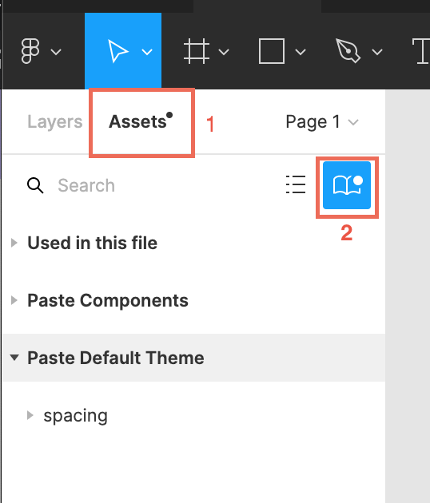
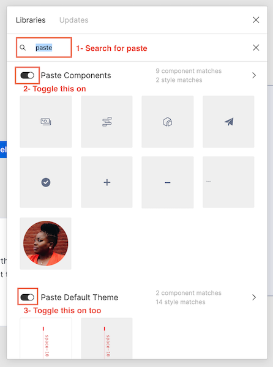
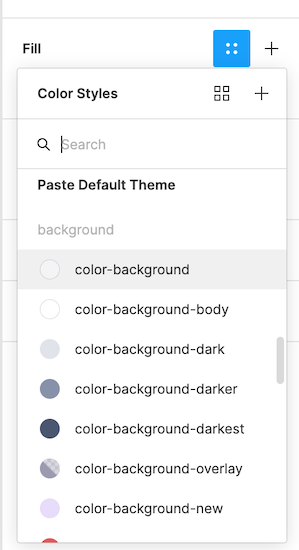

import {graphql} from 'gatsby';
import {Anchor} from '@twilio-paste/anchor';
import {Box} from '@twilio-paste/box';
import {Text} from '@twilio-paste/text';
import {Paragraph} from '@twilio-paste/paragraph';
import {Disclosure, DisclosureHeading, DisclosureContent} from '@twilio-paste/disclosure';
import {Tooltip} from '@twilio-paste/tooltip';
import {Stack} from '@twilio-paste/stack';
import {Callout, CalloutTitle, CalloutText} from '../../../components/callout';

import {SuccessIcon} from '@twilio-paste/icons/esm/SuccessIcon';
import {WarningIcon} from '@twilio-paste/icons/esm/WarningIcon';
import {ErrorIcon} from '@twilio-paste/icons/esm/ErrorIcon';

export const pageQuery = graphql`
  {
    mdx(fields: {slug: {eq: "/getting-started/design/"}}) {
      fileAbsolutePath
      frontmatter {
        slug
        title
      }
      headings {
        depth
        value
      }
    }
  }
`;

<content>

<h1>{props.pageContext.frontmatter.title}</h1>

<Paragraph>{props.pageContext.frontmatter.description}</Paragraph>

</content>

---

<contentwrapper>

<PageAside data={props.data.mdx} />

<content>

## Fonts

Fonts in Paste are preloaded into Figma so you don't have to worry about downloading or installing them.

### Fira Mono

[Fira Mono](https://fonts.google.com/specimen/Fira+Mono?query=fira+mono) is a free Google font and our monospace typeface for code. If you are using <strong>any theme</strong> in Paste, you will need to use it.

### SF Pro

If you are using <strong>any theme</strong> in Paste, you will need to [download and install SF Pro](https://developer.apple.com/fonts/), the
system font for Apple platforms. We represent native web element styles (like option lists in [Select](/components/select/)) in
our design assets in the macOS styles.

### Inter

If you are using the <strong>Default theme</strong> in Paste, you will need
to [download and install Inter](https://github.com/rsms/inter/releases/download/v3.15/Inter-3.15.zip), which we use for UI text.
It’s a free font. After you download the files, follow the instructions in the
`install-mac.txt` file in your download. We recommend following the steps using Font Book.

### Whitney

If you are using the <strong>Console theme</strong> in Paste, you will need to download Whitney, which we use for UI text.
Reach out to us in `#help-design-system` if you need access to the Whitney font files for your work.

---

## Figma

As a Twilio Designer you have access to Figma. Join the Twilio organization by requesting an
account through [ServiceNow](https://twilio.service-now.com/sp/). To learn more,
review our [working with Figma guide](https://www.figma.com/file/WiJFrYa9YpIcFUmT06gTn0/Working-with-Figma).

### How to turn on libraries

👉&nbsp;&nbsp;Ideally, you won’t have to worry too much about turning libraries on if you’re
joining an existing team. A "Team Owner" (or "Admin") should have already gone through
the steps of turning on default libraries (like the Paste and Console Navigation
libraries) with these steps: [setting up a Figma team](https://docs.google.com/document/d/1IOBY2kxdHB6b8nlSWIFOLK7TKTV-Xxv7czzCZIVTAxg/edit#heading=h.f209dtpr7col).

If you want to control libraries per file, go to the “Assets” tab on a file. This is
also where you can drag in components to your file. Click the book icon in the upper
corner. From the modal, you can turn libraries on and off.

The main libraries we recommend you have enabled for each file are:

- [Paste Components](https://www.figma.com/file/E6KUvMhioUmAgN0nwmReTM/Paste-Components)
- [Paste Default Theme](https://www.figma.com/file/OZKRQFOkOAl413m5JVIYE6/Paste-Default-Theme) includes tokens (color, text, and shadow styles), needed for the Paste components library
- [Paste Patterns](https://www.figma.com/file/S4z0Kqjb9AYosnkRQldLte/Paste-Patterns)
- [Brand Illustrations](https://www.figma.com/file/XeA9WNBcoojrdJbiz5Nj5q/Brand-Illustrations) includes illustrations for empty states, sections, etc
- [Asset Documentation](https://www.figma.com/file/GfY11A2VW638eFK48nDtdE/Asset-Documentation) includes helpful utilities for marking up designs, like sticky notes and cursors
- [File and Cover Sheet Template](https://www.figma.com/file/RfZYRjUH56rZ0qe0veqRJA/File-and-Cover-Sheet-Template)
- [Console Library](https://www.figma.com/file/vvdKgsO8OLcn7Q6FmuhWtl/Console-Library) for teams with Console projects **(managed by the Console team)**
- [SendGrid's legacy SG-DS](https://www.figma.com/file/YgSlHVVKgdCY2BzdTbHsPf/SG-DS) for teams with legacy SendGrid projects **(managed by the SendGrid team)**

Any time a library is updated, you’ll get a notification in your project asking if you’d like to update.

### Using the Paste Components library

The Paste Components library houses Figma components for all components available in
Paste. You can drag and drop components into your project via the Assets panel on the left,
and swap to different variants for a given component via the Design panel on the right.
Some more complex components include nested variants, so be sure to explore the different
layers on each component for any layer with a ⚙️ emoji. This emoji indicates that there are
variants available on that layer. Any layer with a ✏️ emoji indicates an editable layer.
Check out our [tips and tricks](https://www.figma.com/file/E6KUvMhioUmAgN0nwmReTM/Paste-Components?node-id=284%3A1158)
for more helpful hints about using the Paste Components library.

### Using the Paste Default Theme library

Once you have this library linked, you will see text styles (which include font families, font weights, and font sizes), fill
and stroke styles (which include background, border, and text colors), and effect styles (which include shadows) for that theme.

You should be using components from Paste to compose your UIs whenever possible, but the text and layer styles will be helpful when you need to compose something more custom.
This can be anything from setting a piece of text next to an icon to creating a custom stepper component.

### How we publish library updates

We release library updates continuously, and we demarcate changes with hints which you can see in the description of each update:

- 🚀&nbsp;&nbsp;**New**: [summary of a new thing]
- ✨&nbsp;&nbsp;**Improved**: [summary of an improved thing]
- 🐛&nbsp;&nbsp;**Fixed**: [summary of a bug fix]
- ❗️&nbsp;&nbsp;**Breaking**: [summary of a breaking change]

---

## Additional questions or concerns

If you have any questions for us that weren’t covered by this guide, or you are running into problems using our design resources, please [reach out](/getting-started/working-guide)!

</content>

</contentwrapper>
