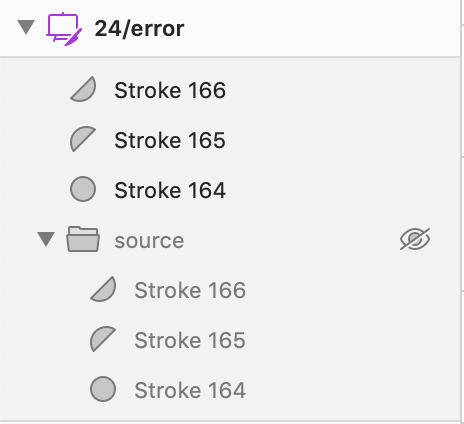

import {graphql} from 'gatsby';
import {Link} from 'gatsby';
import Img from 'gatsby-image';
import {Box} from '@twilio-paste/box';
import {Text} from '@twilio-paste/text';
import {Button} from '@twilio-paste/button';
import {PlusIcon} from '@twilio-paste/icons/esm/PlusIcon';
import {LoadingIcon} from '@twilio-paste/icons/esm/LoadingIcon';
import {Callout, CalloutTitle, CalloutText} from '../../../components/callout';
import {Grid} from '../../../components/grid';

export const pageQuery = graphql`
  {
    mdx(fields: {slug: {eq: "/icons/how-to-add-an-icon/"}}) {
      fileAbsolutePath
      frontmatter {
        slug
        title
      }
      headings {
        depth
        value
      }
    }
  }
`;

<contentwrapper>

<PageAside data={props.data.mdx} />

<content>
<h1>{props.pageContext.frontmatter.title}</h1>

---

## Finding an icon

1. Make sure the icon you need doesn’t already exist in [our icon list](/icons).
2. If the icon can be used for a similar use case to yours in multiple products ("UI icon"), find a new icon by searching through the [Streamline app](https://app.streamlineicons.com/streamline-regular). If the icon needs to be reserved for use in your product only ("logo icon"), please [request one from our Brand team](https://www.twilio.com/brand/resources/logos).
3. Create a [GitHub discussion](https://github.com/twilio-labs/paste/discussions) with:
   1. A link or screenshot of the icon
   2. A brief explanation or mockup of what you'll need it for
   3. Whether this icon is a logo icon or a UI icon.
4. We'll discuss in GitHub if the icon should be added to Paste.

## Using a Streamline icon

1. Copy and paste the Streamline icon onto your icon artboard.
2. Select all the layers and make sure the border width is 1.
3. Select the layer group. Lock the width-height aspect ratio. If the icon appears
   larger than the bounds of the artboard, shrink the icon down so that it's visually aligned with our default text size. Use the "icon tester" artboard on the Icon tester page in the Sketch file to help. Resizing the icon to 16–18 px usually works.
4. Duplicate the layer group. Rename the original group to "source" and hide it.
5. Ungroup the new layer group. You’ll be working with these layers.
   

## Formatting an icon

1. Convert your icons to outlines so that the width of the lines stay consistent.
   1. Select all the layers and press "OPTION + COMMAND + O", or use Sketch's menu, "Layer > Convert to Outlines".
   2. Make sure each layer now has a fill and not a stroke.
2. Create a union with all the pieces of your icon. This will merge individual pieces
   together to create one shape. You can find the Union tool in Sketch's toolbar at the
   top or go to "Layer > Combine > Union".
3. Apply the layer style "icon/color-text-icon" from one of the Paste themes to the
   combined shape. In the layer list, you should only have this shape and the hidden
   "source" group.
4. Rename the combined shape to the icon name in lowercase with spaces (e.g., "link external").
5. Make sure the icon is centered on the artboard both vertically and horizontally.
   If you’re working with an asymmetric shape, you might need to adjust it manually to make
   sure it’s [optically centered](https://blog.marvelapp.com/optical-adjustment-logic-vs-designers/).
   For example, you might need to move a "play" icon a bit
   right-of-center to account for the low visual weight on its right side.
6. Make sure there are no transforms on the shape. If there are, go to "Layer > Combine > Flatten".
   
7. Rename the layers to "icon".

## Adding the icon to the Paste repository

Once the icon is designed and exported, we need to get it in the hands of our developers.
There are two ways for icons to be added into the `@twilio-paste/icons` code package:

1. You can [file an issue on Github](https://github.com/twilio-labs/paste/issues) providing all the
   information you have about the icon. Ideally, this issue would attach the SVG icon generated in
   the above steps. This method is hands-off, but comes at the cost of needing to wait between 2 to 6 weeks
   for us to plan and execute on the work.
2. Alternatively, you can open a Pull Request (PR) on our repository with the required changes.
   This self-service approach would greatly speed up the process of getting your icon into the Paste package
   because it bypasses our team's sprint practices.

### Self-service instructions

1. Fork the Paste repository because PRs can only be open against forks and not branches for security reasons.
2. Clone your newly forked Paste repository: `git clone <url>`
3. Navigate inside the newly cloned repository with `cd paste`
4. Install the dependencies with `yarn install`
5. Add all the new `svg` icon files into the `packages/paste-icons/svg/` folder.
6. From the root Paste folder, run the following command in your terminal: `yarn workspace @twilio-paste/icons convert`
7. Verify your new icons were added correctly by checking the `packages/paste-icons/src` folder to see the newly created source files.
8. Commit your changes and submit a new PR on Github!

## Troubleshooting

If you run into any issues with creating your icon, double check you've followed
all the steps. In the past, we've seen icons that had small artifacts or
missing pieces because of the order of layers within a combined shape
or union. Try moving layers around to get the shape you need, or flattening the icon shape layer.

Get in touch with the Paste team through Slack at #help-design-system.

</content>

</contentwrapper>
