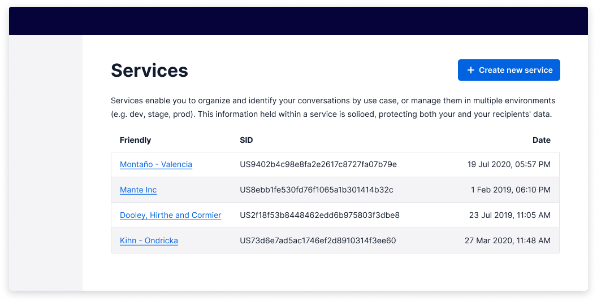
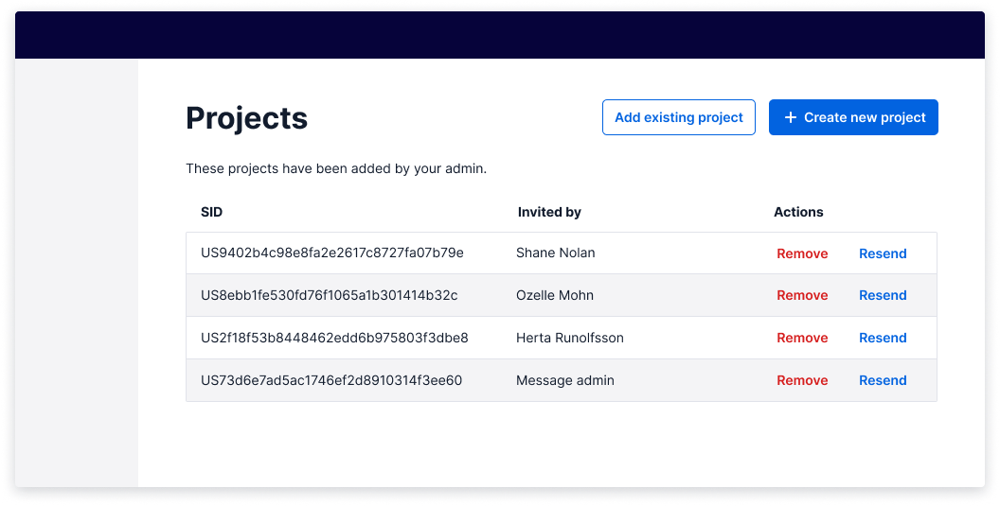
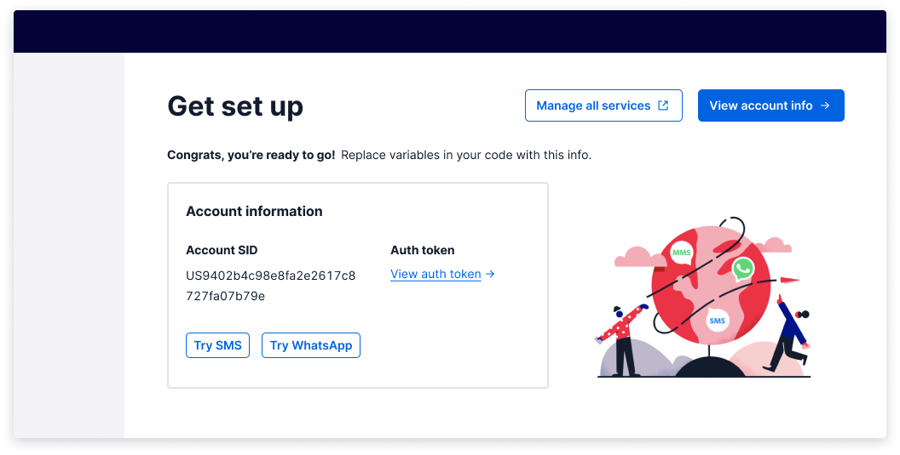
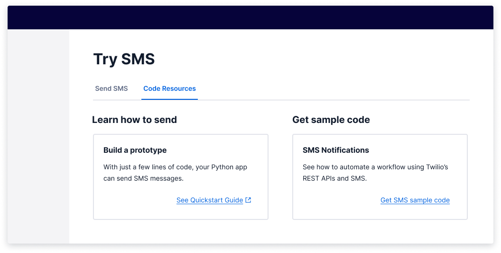

import {graphql} from 'gatsby';
import {Anchor} from '@twilio-paste/anchor';
import {Box} from '@twilio-paste/box';
import {Button} from '@twilio-paste/button';
import {Callout, CalloutTitle, CalloutText} from '../../../components/callout';
import {Card} from '@twilio-paste/card';
import {Heading} from '@twilio-paste/heading';
import {Paragraph} from '@twilio-paste/paragraph';
import {Stack} from '@twilio-paste/stack';
import {Text} from '@twilio-paste/text';
import {UnorderedList, ListItem} from '@twilio-paste/list';
import {PlusIcon} from '@twilio-paste/icons/esm/PlusIcon';
import {ChevronRightIcon} from '@twilio-paste/icons/esm/ChevronRightIcon';

export const pageQuery = graphql`
  {
    mdx(frontmatter: {slug: {eq: "/patterns/button-vs-anchor/"}}) {
      fileAbsolutePath
      frontmatter {
        slug
        title
      }
      headings {
        depth
        value
      }
    }
    allAirtable(filter: {data: {Feature: {eq: "Button vs Anchor"}}}) {
      edges {
        node {
          data {
            Documentation
            Figma
            Design_committee_review
            Engineer_committee_review
            Code
            status
            Product_suitability
          }
        }
      }
    }
  }
`;

<content>

<NormalizePatternHeader
  description={props.pageContext.frontmatter.description}
  name={props.pageContext.frontmatter.title}
  data={props.data}
/>

</content>

---

<contentwrapper>

<PageAside data={props.data.mdx} />

<content>

## Best Practices for Button and Anchor Usage

Action hierarchy on a page should be easy and obvious for our users. To create effective user-centered experiences, it's important to follow user expectations and establish consistent UI action patterns. This is especially important when deciding when to use a button or an anchor (also known as a link).

The [Create pattern](/patterns/create) also includes helpful guidance on how to layout buttons, links, and organize page hierarchy.

---

## Ingredients

<Box marginBottom="space80">
  <Stack orientation="horizontal" spacing="space30">
    <Box marginBottom="space30">
      <Card>
        <Heading as="h3" variant="heading40" marginBottom="space0">
          <Anchor href="/components/button/#primary-button">Primary button</Anchor>
        </Heading>
      </Card>
    </Box>
    <Box marginBottom="space30">
      <Card>
        <Heading as="h3" variant="heading40" marginBottom="space0">
          <Anchor href="/components/button/#secondary-button">Secondary button</Anchor>
        </Heading>
      </Card>
    </Box>
    <Box marginBottom="space30">
      <Card>
        <Heading as="h3" variant="heading40" marginBottom="space0">
          <Anchor href="/components/button/#link-style-button">Link-style button</Anchor>
        </Heading>
      </Card>
    </Box>
    <Box marginBottom="space30">
      <Card>
        <Heading as="h3" variant="heading40" marginBottom="space0">
          <Anchor href="/components/button#destructive-button">Destructive button</Anchor>
        </Heading>
      </Card>
    </Box>
    <Box marginBottom="space30">
      <Card>
        <Heading as="h3" variant="heading40" marginBottom="space0">
          <Anchor href="/components/button#destructive-secondary-button">Secondary destructive button</Anchor>
        </Heading>
      </Card>
    </Box>
    <Box marginBottom="space30">
      <Card>
        <Heading as="h3" variant="heading40" marginBottom="space0">
          <Anchor href="/components/button#link-style-button">Link-style destructive button</Anchor>
        </Heading>
      </Card>
    </Box>
    <Box marginBottom="space30">
      <Card>
        <Heading as="h3" variant="heading40" marginBottom="space0">
          <Anchor href="/components/anchor">Anchor</Anchor>
        </Heading>
      </Card>
    </Box>
  </Stack>
</Box>

## Usage

### General

From a high level, buttons are to be used for **performing an in-page** action and anchors/links are for **navigating to a new page**. You can read more about "why" on the [Button](/components/button#button-vs-anchor-link) and [Anchor/Link](/components/anchor) documentation.

Because a button's functionality is distinctly different from an anchor, we need to be deliberate in their use. An example of this might be opening a link in a new tab; this action can't be performed by a button. If we make it look like a button, it can be confusing due to unmet user expectations and multiple [accessibility concerns](/components/button#accessibility).

To determine the overall hierarchy on a page, you must prioritize which actions the user needs to perform first. Actions that are low effort or not as important should be a secondary button or link-style button. This means that clicking on an anchor should not add, change, or delete any data on the screen.

### Do's and don'ts

#### Accessibility

When we make buttons look like anchors and anchors look like buttons, we are telling users that they are the same thing, when they really aren't. Not only is this confusing, but there are a myriad of [accessibility concerns](/components/button#accessibility) surrounding incorrect usage, too. Some tips for making sure you're using buttons and anchors the right way:

- Correctly choosing between an anchor or button element will help inform all users—but especially assistive technology users—what will happen next. Will I be taken to an entirely new page or will something happen on the current page?
- When using anchors that look like buttons, be very strategic in their use since voice dictation users may encounter issues when trying to activate them. A user may say, "Click the ‘Show more' button", but if that button is actually an anchor styled as a button, the dictation software won't be able to find it, since it can't tell what the anchor looks like visually. If an anchor that looks like a button is needed, make sure to **include an arrow icon** to indicate to the user that they are being navigated to a new page.

## Buttons

### Primary button

Use only one per page; this is the most important action a user needs to take. Optionally, you can add an icon to the left of the text to indicate important actions such as, "**+ Create new**".

If you decide to place an icon in a button, all button icons should be placed to the left. The only exception to this guidance is when you are moving the user forward (like in a multi-step modal, or when paginating through something). Only then should you use a "**Forward >**" (ChevronRightIcon) button. Don't use an arrow icon, since those are reserved for anchors.

<LivePreview scope={{Button, PlusIcon, ChevronRightIcon, Stack}} language="jsx">
  {`<Stack orientation="horizontal" spacing="space30">
  <Button variant="primary" onClick={() => {}}>
    Primary
  </Button>
  <Button variant="primary" onClick={() => {}}>
    <PlusIcon decorative />
    Create new
  </Button>
  <Button variant="primary" onClick={() => {}}>
    Next
    <ChevronRightIcon decorative />
  </Button>
</Stack>`}
</LivePreview>

### Secondary button

Most actions on a page are secondary buttons. Use them for safe and easily reversible actions.

There are some cases where a secondary button may be used for an irreversible action. An example of this would be a ‘Cancel' secondary button that may cause a customer to redo a long user flow. In this case, it should trigger an "Are you sure?" dialog or something similar. Check out the [delete pattern](/patterns/delete) for more guidance. This would be best to test with your users.

<LivePreview scope={{Button}} language="jsx">
  {`<Button variant="secondary" onClick={() => {}}>
  Secondary
</Button>`}
</LivePreview>

### Link-style button (tertiary)

<Callout variant="warning">
  <CalloutTitle as="h4">This is not a variant we recommend you use often.</CalloutTitle>
  <CalloutText>
    When using buttons that look similar to anchors, <strong>be very strategic</strong> in their use since voice
    dictation users may encounter issues when trying to activate them by mistaking them for anchors.
  </CalloutText>
</Callout>

If you need to add additional, less-visually competitive actions on a page, use a link-style button. If you've exhausted the use of primary and secondary buttons, a link-style button is the way to go.

This can be used for the least important actions a user needs to take or when the use of multiple secondary buttons would be visually overwhelming. Given this information, you should weigh the risks between the UI control being unclear and the actions on the page being overwhelming.

When making this decision, it's **a great opportunity to test** which buttons you might need with your users.

<LivePreview scope={{Button, Stack}} language="jsx">
  {`<Stack orientation="horizontal" spacing="space30">
  <Button variant="link" onClick={() => {}}>
    Link-style button
  </Button>
  <Button variant="destructive_link" onClick={() => {}}>
    Link-style button
  </Button>
</Stack>`}
</LivePreview>

### Buttons with link functionality

<Callout variant="warning">
  <CalloutTitle as="h4">This is not a variant we recommend you use often.</CalloutTitle>
  <CalloutText>
    When using buttons as anchors, be very strategic in their use and placement. Screen dictation software may
    experience usability issues, as it is confusing to hear a link read out when looking at a button.
  </CalloutText>
</Callout>

Buttons that **navigate** the user can only be represented by the `primary` and `secondary` variants.
When this is used, it must be accompanied by an arrow pointing to the right or an external
link icon after the text. The icons help to indicate that the action performed on click is a navigation.
These button types do not have `disabled` or `loading` states, as anchors cannot be in those states.

To create a button-styled anchor, use the Button component and add the `as="a"` prop so that it is rendered as an anchor semantically, while maintaining button styling.

**Note:** The same guidance applies for any action deemed "primary"; use only one per page.

<LivePreview scope={{Button, Stack}} language="jsx">
  {`<Stack orientation="horizontal" spacing="space30">
  <Button as="a" href="#" variant="primary">
    Button as anchor (internal link)
  </Button>
  <Button as="a" href="https://twilio.com" variant="secondary">
    Button as anchor (external link)
  </Button>
</Stack>`}
</LivePreview>

## Anchors

### Basic Anchor

For all anchors, the only functionality it supports is navigating. For this reason, an external link is generally the only icon that should be paired with anchors.

<LivePreview scope={{Anchor, Stack}} language="jsx">
  {`<Stack orientation="horizontal" spacing="space30">
  <Anchor href="#">
    Anchor
  </Anchor>
  <Anchor href="#" showExternal>
    External anchor
  </Anchor>
</Stack>`}
</LivePreview>

### Anchors in text

Anchors should be the **ONLY** thing we underline in text, because underlined static text could be mistaken for a link. Links can be used within bodies of text to indicate the presence of related content. If you're linking to an external page, use the [external anchor](/components/anchor#external-anchor).

<LivePreview scope={{Anchor, Paragraph}} language="jsx">
  {`<Paragraph>
  For further information, assistance, or help, <Anchor href="#">contact our new business development team</Anchor>. We're experienced in delivering messages to each of these countries, and will assist you in making a success of your messaging program.
</Paragraph>`}
</LivePreview>

## Destructive Buttons and Anchors

The destructive variants of the button and anchors should follow the same guidance as the non-destructive variants.

## Final tips

- Pairing a button label with an icon reinforces meaning and quickens recognition. Use at your discretion.
- All buttons and links should be written as succinctly as possible and make sense on their own (e.g., don't write "Click here"). This is especially important for users of assistive technology who often navigate through a list of all actions on a page, meaning they might not know about any contextual information surrounding a given action.

## Starter kits

### CodeSandbox

Coming soon

### Figma

- [Anchor](https://www.figma.com/file/E6KUvMhioUmAgN0nwmReTM/Paste-Components?node-id=453%3A1630)
- [Button](https://www.figma.com/file/E6KUvMhioUmAgN0nwmReTM/Paste-Components?node-id=400%3A851)

</content>

</contentwrapper>
