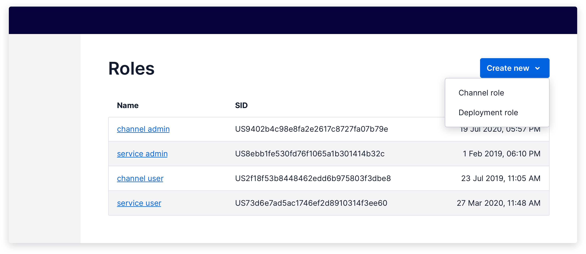

import {graphql} from 'gatsby';
import {Anchor} from '@twilio-paste/anchor';
import {Box} from '@twilio-paste/box';
import {Callout, CalloutTitle, CalloutText} from '../../../components/callout';
import {Card} from '@twilio-paste/card';
import {Disclosure, DisclosureHeading, DisclosureContent} from '@twilio-paste/disclosure';
import {Grid, Column} from '@twilio-paste/grid';
import {Heading} from '@twilio-paste/heading';
import {Paragraph} from '@twilio-paste/paragraph';
import {Text} from '@twilio-paste/text';
import {useUID} from '@twilio-paste/uid-library';

export const pageQuery = graphql`
  {
    mdx(frontmatter: {slug: {eq: "/patterns/create/"}}) {
      fileAbsolutePath
      frontmatter {
        slug
        title
      }
      headings {
        depth
        value
      }
    }
    allAirtable(filter: {data: {Feature: {eq: "Create"}}}) {
      edges {
        node {
          data {
            Documentation
            Figma
            Design_committee_review
            Engineer_committee_review
            Code
            status
            Product_suitability
          }
        }
      }
    }
  }
`;

<content>

<NormalizePatternHeader
  description={props.pageContext.frontmatter.description}
  name={props.pageContext.frontmatter.title}
  data={props.data}
/>

</content>

---

<contentwrapper>

<PageAside data={props.data.mdx} />

<content>

## Ingredients

<Grid gutter="space30" marginBottom="space80">
  <Column>
    <Card>
      <Heading as="h3" variant="heading40" marginBottom="space0">
        <Anchor href="/components/button">Button</Anchor>
      </Heading>
    </Card>
  </Column>
  <Column>
    <Card>
      <Heading as="h3" variant="heading40" marginBottom="space0">
        <Anchor href="/components/anchor">Anchor</Anchor>
      </Heading>
    </Card>
  </Column>
  <Column>
    <Card>
      <Heading as="h3" variant="heading40" marginBottom="space0">
        <Anchor href="/components/menu">Menu</Anchor>
      </Heading>
    </Card>
  </Column>
  <Column>
    <Card>
      <Heading as="h3" variant="heading40" marginBottom="space0">
        <Anchor href="/components/toast">Toast</Anchor>
      </Heading>
    </Card>
  </Column>
</Grid>

```jsx
// import all ingredients for the create patterns

import {​ Button } from "@twilio-paste/core/button";
import { Menu } from "@twilio-paste/core/menu";
import { Anchor } from "@twilio-paste/core/anchor;
import { Toast } from "@twilio-paste/core/toast";
```

## Usage

### General

The create pattern should be used when a user is creating a new instance of something, such as a service or a contact list. The create action is often the most important action on the page, so it’s important to drive consistency around how we present this action to our users.

The create action should:

- Be initiated by either a Button or an Anchor (also known as a “link”).
- Use plain, direct language, so that the user knows what is going to happen when they click it. For example, “create new service” instead of just “create”.
- Start with the word "create" when the user is creating a new object, like a new service.
- Start with the word "add" when the user is choosing an existing object, like an existing phone number.
- Be placed near where the object will appear once it has been created, such as at the top of a table if there are pre-existing instances, or in the center of an empty state, if the user has not created any instances of this object yet.

### Accessibility

Use an anchor if the create action will take the user to a new page, and in all other cases, use a button. There is more information on how this works in practice in the [anchor](#anchor) variant of the create pattern.

## Variations

### Standard

This is a standard create pattern. The create action is the primary action on the page, and clicking it will trigger an in-page interaction, such as opening a modal where the user will enter details about the new object.

The create action is placed at the top right of the area where the object will appear once it has been created. In this example, the entire page is dedicated to displaying the user’s services, so the “create new service” action is placed at the top of the page next to the page header.


<Box marginBottom="space80">
  <Disclosure variant="contained">
    <DisclosureHeading as="h5" variant="heading50">
      Show live example
    </DisclosureHeading>
    <DisclosureContent>Coming soon!</DisclosureContent>
  </Disclosure>
</Box>

### Multi-option

In some cases, there will be multiple types of an object the user can create. In this case, the create action should trigger a menu which lists the different options. Whenever possible, use a single button with a menu rather than including multiple buttons or anchors.

In the case where the user can either create a new object or add an existing object from the same trigger, the trigger for the action should start with "add" rather than "create". For example, when the trigger allows the user to either add an existing phone number or buy a new phone number, the action text should be "add phone number".



<Box marginBottom="space80">
  <Disclosure variant="contained">
    <DisclosureHeading as="h5" variant="heading50">
      Show live example
    </DisclosureHeading>
    <DisclosureContent>Coming soon!</DisclosureContent>
  </Disclosure>
</Box>

### Anchor

If clicking the create action will take the user to a new page, use an anchor, but maintain the same placement on the page so that the user can find the action easily. An “add” icon should be used with the anchor to draw the eye and add further clarity.


<Box marginBottom="space80">
  <Disclosure variant="contained">
    <DisclosureHeading as="h5" variant="heading50">
      Show live example
    </DisclosureHeading>
    <DisclosureContent>Coming soon!</DisclosureContent>
  </Disclosure>
</Box>

If you find, through usability testing, that the anchor style does not give the create action enough visual prominence, you can use an anchor styled as a button instead. **Only do this in cases where using the anchor style hinders the usability of the feature**, as styling an anchor as a button comes with [accessibility trade-offs](https://marcysutton.com/links-vs-buttons-in-modern-web-applications).

When using an anchor styled as a button, consider adding an arrow icon to offer some affordance that the button will navigate the user to a new page. Also, ensure to add the `as="a"` prop to the button component so that it is rendered as an anchor semantically, while maintaining button styling.

For more information about using buttons and anchors, read the [best practices for button and anchor usage guide](/patterns/button-vs-anchor).


<Box marginBottom="space80">
  <Disclosure variant="contained">
    <DisclosureHeading as="h5" variant="heading50">
      Show live example
    </DisclosureHeading>
    <DisclosureContent>Coming soon!</DisclosureContent>
  </Disclosure>
</Box>

### Sub-section

When a single page includes multiple, separate create actions that are separated by something like tabs, the create action must be placed in the correct hierarchy. Instead of placing the action in the page header, the create action should be placed within the sub-section, such as at the top right of a table within a tab.


<Box marginBottom="space80">
  <Disclosure variant="contained">
    <DisclosureHeading as="h5" variant="heading50">
      Show live example
    </DisclosureHeading>
    <DisclosureContent>Coming soon!</DisclosureContent>
  </Disclosure>
</Box>

### Card

When the data being displayed is more suited to a card layout rather than a table layout, the create action will live inside of an empty card at the start of the list of objects.


<Box marginBottom="space80">
  <Disclosure variant="contained">
    <DisclosureHeading as="h5" variant="heading50">
      Show live example
    </DisclosureHeading>
    <DisclosureContent>Coming soon!</DisclosureContent>
  </Disclosure>
</Box>

### Empty state

If the user has not yet created any instances of this object, they should see an empty state with a create action within it. Follow [the Empty State pattern](/patterns/empty-state) in this case.

## Creation flow

Bringing consistency to what happens after the user triggers the Create action is also a critical part of this pattern.

<Callout>
  <CalloutTitle>This pattern is coming soon!</CalloutTitle>
  <CalloutText>
    We've not yet patternized this part of Create. If you need this for your current or upcoming work, please consider
    partnering with us to <Anchor href="/introduction/contributing/patterns">contribute it</Anchor>.
  </CalloutText>
</Callout>

## Post-creation

After the user has created a new object, navigate them either back to the index page, where they can see a list of all objects, or to the individual object detail page (whichever makes most sense for the given user flow), and show a success [Toast](/components/toast) informing them that the object has successfully been created.

If the create action fails, keep the user where they were and display an error [Toast](/components/toast) that explains what went wrong and how to try again.

For more information, check out our [Notifications and Feedback patterns](/patterns/notifications-and-feedback).

## Starter kits

### CodeSandbox

Coming soon

### Figma

Coming soon

</content>

</contentwrapper>
