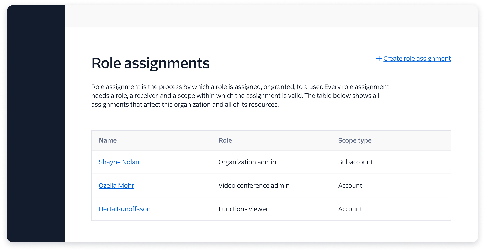

import {graphql} from 'gatsby';
import {Anchor} from '@twilio-paste/anchor';
import {Box} from '@twilio-paste/box';
import {Callout, CalloutTitle, CalloutText} from '../../../components/callout';
import {Card} from '@twilio-paste/card';
import {Disclosure, DisclosureHeading, DisclosureContent} from '@twilio-paste/disclosure';
import {Grid, Column} from '@twilio-paste/grid';
import {Heading} from '@twilio-paste/heading';
import {Paragraph} from '@twilio-paste/paragraph';
import {Text} from '@twilio-paste/text';
import {useUID} from 'react-uid';

export const pageQuery = graphql`
  {
    mdx(fields: {slug: {eq: "/patterns/create/"}}) {
      fileAbsolutePath
      frontmatter {
        slug
        title
      }
      headings {
        depth
        value
      }
    }
  }
`;

<content>

<h1>{props.pageContext.frontmatter.title}</h1>

<Paragraph>{props.pageContext.frontmatter.description}</Paragraph>

<Box as="dl" display="flex">
  <Text as="dt" color="colorTextWeak" lineHeight="lineHeight30">
    <Box width="size10">
      Status
    </Box>
  </Text>
  <Text as="dd">
    alpha
  </Text>
</Box>

<Callout variant="warning">
  <CalloutTitle>This is a proof of concept, and we need your feedback!</CalloutTitle>
  <CalloutText>
    We've created a few alpha patterns as a proof of concept to collect feedback. If you have thoughts on this particular pattern, or on the documentation of patterns as a whole, please <Anchor href="https://forms.gle/BzeekGGXd2uL6U7Z9">let us know</Anchor>! We need your feedback to make our patterns better.
  </CalloutText>
</Callout>

</content>

---

<contentwrapper>

<PageAside data={props.data.mdx} />

<content>

## Ingredients

<Grid gutter="space30" marginBottom="space80">
  <Column>
    <Card>
      <Heading as="h3" variant="heading40" marginBottom="space0">
        <Anchor href="../components/button">
          Button
        </Anchor>
      </Heading>
    </Card>
  </Column>
  <Column>
    <Card>
      <Heading as="h3" variant="heading40" marginBottom="space0">
        <Anchor href="../components/Anchor">
          Anchor
        </Anchor>
      </Heading>
    </Card>
  </Column>
  <Column>
    <Card>
      <Heading as="h3" variant="heading40" marginBottom="space0">
        <Anchor href="../components/menu">
          Menu
        </Anchor>
      </Heading>
    </Card>
  </Column>
  <Column>
    <Card>
      <Heading as="h3" variant="heading40" marginBottom="space0">
        <Anchor href="../components/toast">
          Toast
        </Anchor>
      </Heading>
    </Card>
  </Column>
</Grid>

```jsx
import {Button} from '@twilio-paste/button';
import {Anchor} from '@twilio-paste/anchor';
import {Menu} from '@twilio-paste/menu';
import {Toast} from '@twilio-paste/toast';
```

## Usage

### General

The create pattern should be used when a user is creating a new instance of something, such as a service or a contact list. The create action is often the most important action on the page, so it’s important to drive consistency around how we present this action to our users.

The create action should:
- Be initiated by either a Button or an Anchor (also known as a “link”).
- Use plain, direct language, so that the user knows what is going to happen when they click it. For example, “create new service” instead of just “create”.
- Be placed near where the object will appear once it has been created, such as at the top of a table if there are pre-existing instances, or in the center of an [empty state](/patterns/empty-state), if the user has not created any instances of this object yet.

### Accessibility

Whenever possible, use an anchor if the create action will take the user to a new page, and in all other cases, use a button. [Learn more](/components/button/#button-vs-anchor-link) about why this is important for the user experience.

## Variations

### Standard

This is a standard create pattern. The create action is the primary action on the page, and clicking it will trigger an in-page interaction, such as opening a modal where the user will enter details about the new object.

The create action is placed at the top right of the area where the object will appear once it has been created. In this example, the entire page is dedicated to displaying the user’s services, so the “create new service” action is placed at the top of the page next to the header.


<Box marginBottom="space80">
  <Disclosure>
    <DisclosureHeading as="h5" variant="heading50">
      Show live example
    </DisclosureHeading>
    <DisclosureContent>
      Coming soon!
    </DisclosureContent>
  </Disclosure>
</Box>

### Multi-option

In some cases, there will be multiple types of an object the user can create. In this case, the create action should trigger a menu which lists the different options. Whenever possible, use a single button with a menu rather than including multiple buttons or anchors.

Sometimes, the decision the user needs to make at this stage will be too complex to capture in a menu. In that case, open a modal or take the user to a new page instead.


<Box marginBottom="space80">
  <Disclosure>
    <DisclosureHeading as="h5" variant="heading50">
      Show live example
    </DisclosureHeading>
    <DisclosureContent>
      Coming soon!
    </DisclosureContent>
  </Disclosure>
</Box>

### Anchor

If clicking the create action will take the user to a new page, use an anchor, but maintain the same placement on the page so that the user can find the action easily. An “add” icon should be used with the anchor to draw the eye and add further clarity.



<Box marginBottom="space80">
  <Disclosure>
    <DisclosureHeading as="h5" variant="heading50">
      Show live example
    </DisclosureHeading>
    <DisclosureContent>
      Coming soon!
    </DisclosureContent>
  </Disclosure>
</Box>

### Sub-section

When a single page includes multiple, separate create actions that are separated by something like tabs, the create action must be placed in the correct hierarchy. Instead of placing the action in the page header, the create action should be placed within the sub-section, such as at the top right of a table within a tab.


<Box marginBottom="space80">
  <Disclosure>
    <DisclosureHeading as="h5" variant="heading50">
      Show live example
    </DisclosureHeading>
    <DisclosureContent>
      Coming soon!
    </DisclosureContent>
  </Disclosure>
</Box>

### Empty state

If the user has not yet created any instances of this object, they should see an empty state with a create action within it. Follow the [empty state](/patterns/empty-state) pattern in this case.

## Post-creation

After the user has created a new object, navigate them either back to the index page, where they can see a list of all objects, or to the individual object detail page (whichever makes most sense for the given user flow), and show a success [Toast](../components/toast) informing them that the object has successfully been created.

If the create action fails, display an error [Toast](../components/toast) that explains what went wrong and how to try again.

## Starter kits

### CodeSandbox

Coming soon

### Sketch

Coming soon

</content>

</contentwrapper>
