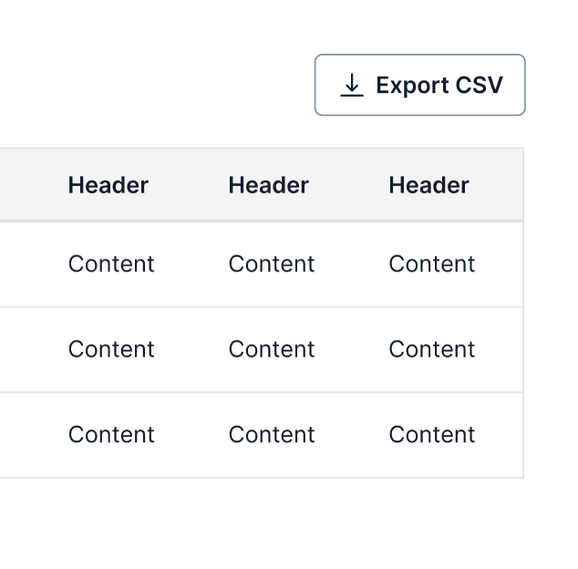
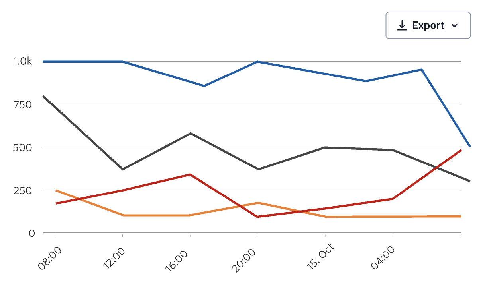
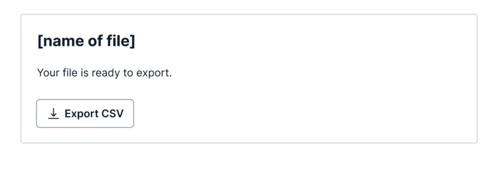

import {graphql} from 'gatsby';
import {Anchor} from '@twilio-paste/anchor';
import {Box} from '@twilio-paste/box';
import {Card} from '@twilio-paste/card';
import {Disclosure, DisclosureHeading, DisclosureContent} from '@twilio-paste/disclosure';
import {Grid, Column} from '@twilio-paste/grid';
import {Heading} from '@twilio-paste/heading';
import {Paragraph} from '@twilio-paste/paragraph';
import {Tooltip} from '@twilio-paste/tooltip';
import {Button} from '@twilio-paste/button';
import {Text} from '@twilio-paste/text';
import {MenuButton, MenuItem, Menu, useMenuState} from '@twilio-paste/menu';
import {ChevronDownIcon} from '@twilio-paste/icons/esm/ChevronDownIcon';
import {ExportIcon} from '@twilio-paste/icons/esm/ExportIcon';
import {CheckboxGroup, Checkbox} from '@twilio-paste/checkbox';
import {Toaster, useToaster} from '@twilio-paste/toast';
import {Modal, ModalHeader, ModalHeading, ModalBody, ModalFooter, ModalFooterActions} from '@twilio-paste/modal';
import {useUID, useUIDSeed} from '@twilio-paste/uid-library';
import {Callout, CalloutTitle, CalloutText} from '../../../components/callout';
import {
  exportButton,
  exportMenu,
  exportModal,
  exportDelayed,
} from '../../../component-examples/DataExportPatternExamples';

export const pageQuery = graphql`
  {
    mdx(fields: {slug: {eq: "/patterns/data-export/"}}) {
      fileAbsolutePath
      frontmatter {
        slug
        title
      }
      headings {
        depth
        value
      }
    }
    allAirtable(filter: {data: {Feature: {eq: "Data Export"}}}) {
      edges {
        node {
          data {
            Documentation
            Figma
            Design_committee_review
            Engineer_committee_review
            Code
            status
            Product_suitability
          }
        }
      }
    }
  }
`;

<content>

<PatternHeader
  description={props.pageContext.frontmatter.description}
  name={props.pageContext.frontmatter.title}
  packageStatus={props.data.allAirtable.edges}
/>

</content>

---

<contentwrapper>

<PageAside data={props.data.mdx} />

<content>

## Ingredients

<Grid gutter="space30" marginBottom="space80">
  <Column>
    <Card>
      <Heading as="h3" variant="heading40" marginBottom="space0">
        <Anchor href="/components/button">Button</Anchor>
      </Heading>
    </Card>
  </Column>
  <Column>
    <Card>
      <Heading as="h3" variant="heading40" marginBottom="space0">
        <Anchor href="/components/menu">Menu</Anchor>
      </Heading>
    </Card>
  </Column>
  <Column>
    <Card>
      <Heading as="h3" variant="heading40" marginBottom="space0">
        <Anchor href="/components/anchor">Anchor</Anchor>
      </Heading>
    </Card>
  </Column>
</Grid>
<Grid gutter="space30" marginBottom="space80">
  <Column>
    <Card>
      <Heading as="h3" variant="heading40" marginBottom="space0">
        <Anchor href="/icons">Export Icon</Anchor>
      </Heading>
    </Card>
  </Column>
  <Column>
    <Card>
      <Heading as="h3" variant="heading40" marginBottom="space0">
        <Anchor href="/components/toast">Toast</Anchor>
      </Heading>
    </Card>
  </Column>
  <Column>
    <Card>
      <Heading as="h3" variant="heading40" marginBottom="space0">
        <Anchor href="/components/tooltip">Tooltip</Anchor>
      </Heading>
    </Card>
  </Column>
</Grid>

```jsx
// import all ingredients for the Data export pattern

import {​ Button } from "@twilio-paste/core/button";
import { ExportIcon } from "@twilio-paste/icons/esm/ExportIcon";
import { Menu } from "@twilio-paste/core/menu";
import { Tooltip } from "@twilio-paste/core/tooltip";
import { Anchor } from "@twilio-paste/core/anchor";
import { Toast } from "@twilio-paste/core/toast";
```

## Usage

### General

The Data export pattern enables customers to extract all or selected data
from a data table or graph. Data is usually placed into a CSV, PNG, PDF,
or JSON file. In general, data exports are generated by the server in
Twilio products (particularly CSVs in Voice & Video, SIP trunking, and Messaging).

Exporting should:

- Be triggered by a [Button](/components/button) (or [Button as Anchor](/patterns/button-vs-anchor#buttons-with-link-functionality))
  or [Menu item](/components/menu). The Button or Menu item should clearly state what type of file
  will be exported. E.g. “Export CSV”.
- Tell the customer if there are any limitations to the data that can be exported.
  Use a [Tooltip](/components/tooltip) to communicate this information.

<LivePreview scope={{Tooltip, Button, ExportIcon}} noInline language="jsx">
  {exportButton}
</LivePreview>

Using the word “Export” and the ExportIcon are predictable signals to customers that they can extract data from Twilio.

Twilio products generally enable customers to convert files to a range of formats before downloading and saving. However if you can’t provide a format conversion, you should still use the word “Export” and the ExportIcon.

The delayed export is an exception to this copy guideline and uses the word “Download” and the DownloadIcon instead. action is placed at the top right of the area where the object will appear once it has been created. In this example, the entire page is dedicated to displaying the user’s services, so the “create new service” action is placed at the top of the page next to the page header.

## Variations

### Immediate export

An immediate export happens when a customer can download their export on
the same page where they clicked the export Button or Menu item.

When using a Button, while an export is in progress, show the Button loading
state. When it’s in a loading state, it will disable by default.

<LivePreview
  scope={{MenuButton, MenuItem, Menu, useMenuState, Button, ChevronDownIcon, ExportIcon}}
  noInline
  language="jsx"
>
  {exportMenu}
</LivePreview>

Most often, selecting the export Button or Menu item should trigger a “save as”
dialog in the browser. Customers will be able to track the export’s download
status through their browser.

However in cases where you might offer more customization of the data, you
can trigger a Modal first. In the Modal, customers can select what columns
to export, additional file formats, etc.

<LivePreview
  scope={{
    useUIDSeed,
    CheckboxGroup,
    Checkbox,
    Modal,
    ModalHeader,
    ModalHeading,
    ModalBody,
    ModalFooter,
    ModalFooterActions,
    Tooltip,
    Button,
    ExportIcon,
  }}
  noInline
  language="jsx"
>
  {exportModal}
</LivePreview>

### Delayed export

A delayed export happens when a customer needs to wait for data to be ready.
Use the same components as the immediate export pattern, but make sure to:

1. Confirm the export was initiated by using a Toast component. Inform the customer that they’ll receive an email notification when it’s ready.
2. Send an email notification to the customer when the export is ready, with a link to or attachment of the file(s). In this second step, use the word “Download” (example: “Download CSV”) to trigger the actual file download since the customer already clicked an export action to start the export process.

<LivePreview
  scope={{
    Toaster,
    useToaster,
    Button,
    ExportIcon,
  }}
  noInline
  language="jsx"
>
  {exportDelayed}
</LivePreview>

## Positioning the export action

Place the export Button above and right-aligned to the data it’s exporting,
usually a data table or graph.





It can also be placed in a card component that shows the specific data that will
be exported, such as a billing invoice.



## Starter kits

### Design Templates

Coming soon

## Related Discussions

- [Content question - "Download" or "Export"](https://github.com/twilio-labs/paste/discussions/990)
- [Button for downloading a file](https://github.com/twilio-labs/paste/discussions/848)

</content>

</contentwrapper>
