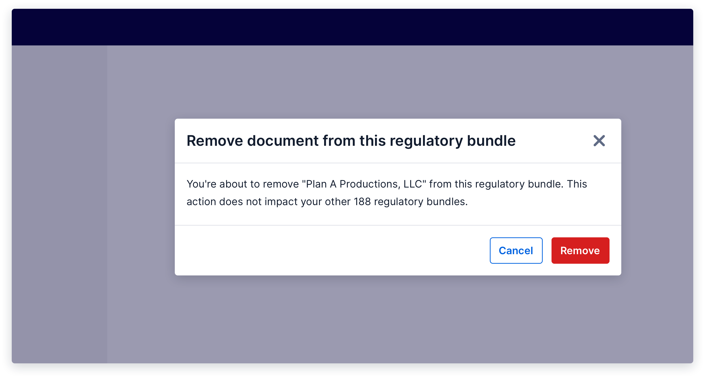
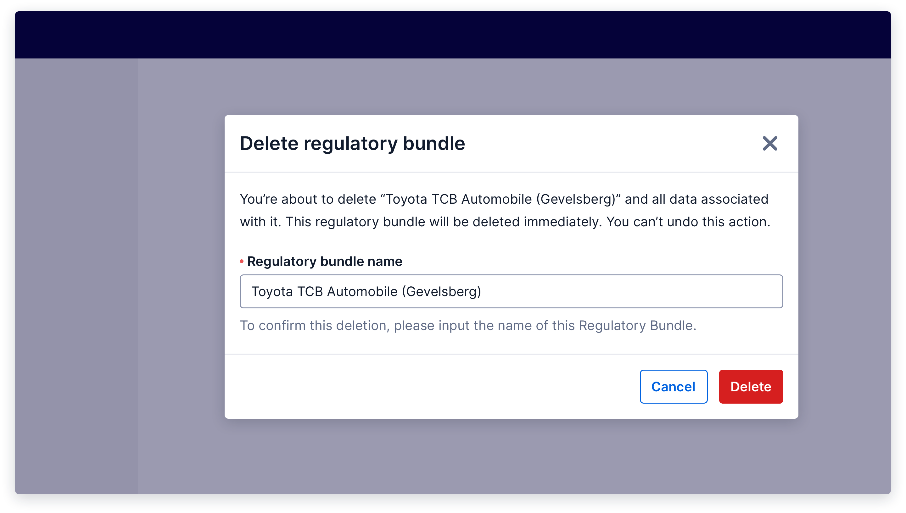

import {graphql} from 'gatsby';
import {Anchor} from '@twilio-paste/anchor';
import {Box} from '@twilio-paste/box';
import {Callout, CalloutTitle, CalloutText} from '../../../components/callout';
import {Card} from '@twilio-paste/card';
import {Disclosure, DisclosureHeading, DisclosureContent} from '@twilio-paste/disclosure';
import {Grid, Column} from '@twilio-paste/grid';
import {Heading} from '@twilio-paste/heading';
import {Paragraph} from '@twilio-paste/paragraph';
import {Text} from '@twilio-paste/text';
import {useUID} from '@twilio-paste/uid-library';

export const pageQuery = graphql`
  {
    mdx(frontmatter: {slug: {eq: "/patterns/delete/"}}) {
      fileAbsolutePath
      frontmatter {
        slug
        title
      }
      headings {
        depth
        value
      }
    }
    allAirtable(filter: {data: {Feature: {eq: "Delete"}}}) {
      edges {
        node {
          data {
            Documentation
            Figma
            Design_committee_review
            Engineer_committee_review
            Code
            status
            Product_suitability
          }
        }
      }
    }
  }
`;

<content>

<NormalizePatternHeader
  description={props.pageContext.frontmatter.description}
  name={props.pageContext.frontmatter.title}
  data={props.data}
/>

</content>

---

<contentwrapper>

<PageAside data={props.data.mdx} />

<content>

## Ingredients

<Grid gutter="space30" marginBottom="space80">
  <Column>
    <Card>
      <Heading as="h3" variant="heading40" marginBottom="space0">
        <Anchor href="/components/button">Button</Anchor>
      </Heading>
    </Card>
  </Column>
  <Column>
    <Card>
      <Heading as="h3" variant="heading40" marginBottom="space0">
        <Anchor href="/components/modal">Modal</Anchor>
      </Heading>
    </Card>
  </Column>
  <Column>
    <Card>
      <Heading as="h3" variant="heading40" marginBottom="space0">
        <Anchor href="/components/input">Input</Anchor>
      </Heading>
    </Card>
  </Column>
  <Column>
    <Card>
      <Heading as="h3" variant="heading40" marginBottom="space0">
        <Anchor href="/components/toast">Toast</Anchor>
      </Heading>
    </Card>
  </Column>
</Grid>

```jsx
// import all ingredients for the delete patterns

import {​ Button } from "@twilio-paste/core/button";
import { Modal, ModalBody, ModalFooter, ModalFooterActions, ModalHeader, ModalHeading } from "@twilio-paste/core/modal";
import { Input } from "@twilio-paste/core/input";
import { Label } from "@twilio-paste/core/label";
import { HelpText } from "@twilio-paste/core/help-text;
import { Toast } from "@twilio-paste/core/toast";
```

## Usage

### General

The delete pattern should be utilized when a user is destroying an object. It is critical to communicate delete actions to our users in a consistent way, considering deletions come with significant consequences and often cannot be undone.

The delete action should:

- Be triggered by a destructive Button.
- Generally be placed at the bottom of an [Object Details](/patterns/object-details) page.
- Not usually be the primary action on the page. There are many variants of differing visual prominence to choose from to achieve the correct hierarchy for the delete action trigger.
- Follow certain guidelines based on the [severity](#variations) of the deletion.

## Variations

### Low-severity

A deletion is considered low-severity when it is trivial to undo the deletion or recreate the deleted data.

Low-severity deletions can be triggered by a single click and do not require further warning or confirmation.

### Medium-severity

A deletion is considered medium-severity when the action cannot be undone, and the data cannot be recreated easily. This pattern is also useful for bulk deletions of low- or medium-severity.

For medium-severity deletions, show a confirmation modal that explains what is being deleted and the consequences of the deletion.



<Box marginBottom="space80">
  <Disclosure variant="contained">
    <DisclosureHeading as="h5" variant="heading50">
      Show live example
    </DisclosureHeading>
    <DisclosureContent>Coming soon!</DisclosureContent>
  </Disclosure>
</Box>

### High-severity

A deletion is considered high-severity when the action cannot be undone, and it would be very time-consuming, or perhaps impossible, to recreate the deleted data. An action that deletes a large amount of data or has significant downstream impact would also be considered a high-severity deletion.

For high-severity deletions, show a confirmation modal that explains what is being deleted and the consequences of the deletion, and have the user manually confirm the deletion by typing the name of the object they are deleting.



<Box marginBottom="space80">
  <Disclosure variant="contained">
    <DisclosureHeading as="h5" variant="heading50">
      Show live example
    </DisclosureHeading>
    <DisclosureContent>Coming soon!</DisclosureContent>
  </Disclosure>
</Box>

## Post-deletion

After the user has deleted the object, navigate them to the index page, where they can see a list of all remaining objects, and show a success [Toast](/components/toast) informing them that the object has successfully been deleted. If it is possible to undo the deletion, give the user the option to do so, and tell them how long they have to undo the deletion if it is time-bound.

If the delete action fails, keep the modal open and display an error [Toast](/components/toast) that explains what went wrong and how to try again.

For more information, check out our [Notifications and Feedback patterns](/patterns/notifications-and-feedback).

## Starter kits

### CodeSandbox

Coming soon

### Figma

Coming soon

</content>

</contentwrapper>
