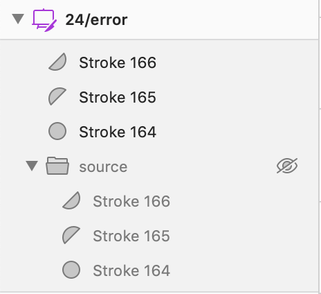

import {graphql} from 'gatsby';
import {Alert} from '@twilio-paste/alert';
import {Anchor} from '@twilio-paste/anchor';
import {Box} from '@twilio-paste/box';
import {Button} from '@twilio-paste/button';
import {Callout, CalloutTitle, CalloutText} from '../../../components/callout';
import {Card} from '@twilio-paste/card';
import {FormInput, FormLabel, FormHelpText, Select, Option} from '@twilio-paste/form';
import {Grid, Column} from '@twilio-paste/grid';
import {Heading} from '@twilio-paste/heading';
import {MediaObject, MediaFigure, MediaBody} from '@twilio-paste/media-object';
import {Paragraph} from '@twilio-paste/paragraph';
import {Stack} from '@twilio-paste/stack';
import {Tabs, TabList, Tab, TabPanels, TabPanel} from '@twilio-paste/tabs';
import {Text} from '@twilio-paste/text';
import {Toast} from '@twilio-paste/toast';
import {ErrorIcon} from "@twilio-paste/icons/esm/ErrorIcon";
import {SuccessIcon} from "@twilio-paste/icons/esm/SuccessIcon";
import {Codeblock} from '../../../components/codeblock';
import {useUID} from 'react-uid';
import {Modal, ModalBody, ModalFooter, ModalFooterActions, ModalHeader, ModalHeading} from '@twilio-paste/modal';
import {defaultExample, initialFocusExample, wideExample} from '../../../component-examples/ModalExamples';

export const pageQuery = graphql`
  {
    mdx(fields: {slug: {eq: "/patterns/delete/"}}) {
      fileAbsolutePath
      frontmatter {
        slug
        title
      }
      headings {
        depth
        value
      }
    }
  }
`;

<content>

<h1>{props.pageContext.frontmatter.title}</h1>

<Paragraph>{props.pageContext.frontmatter.description}</Paragraph>

<Box marginBottom="space80">
  <Stack orientation="vertical" spacing="space30">
  <Alert variant="warning">
    <Text as="span">
      <strong>Please do not share!!</strong> This is a proof of concept meant for feedback only.
    </Text>
  </Alert>
    <Callout variant="warning">
      <CalloutTitle>How to use this proof of concept</CalloutTitle>
      <CalloutText>
        x
      </CalloutText>
    </Callout>
  </Stack>
</Box>

<Box as="dl">
  <Box marginBottom="space30">
    <Text as="dt" display="inline-block" color="colorTextWeak" lineHeight="lineHeight30">
      <Box width="size10">
        Status
      </Box>
    </Text>
    <Text as="dd" display="inline-block">
      alpha
    </Text>
  </Box>
  <Box marginBottom="space30">
    <Text as="dt" display="inline-block" color="colorTextWeak">
      <Box width="size10">
        Console
      </Box>
    </Text>
    <Text as="dd" display="inline-block">
      <MediaObject>
        <MediaFigure spacing="space20">
          <SuccessIcon color="colorTextSuccess" decorative={true} />
        </MediaFigure>
        <MediaBody>
          <Text as="p">
            Patterns available
          </Text>
        </MediaBody>
      </MediaObject>
    </Text>
  </Box>
  <Box marginBottom="space30">
    <Text as="dt" display="inline-block" color="colorTextWeak">
      <Box width="size10">
        Flex
      </Box>
    </Text>
    <Text as="dd" display="inline-block">
      Some patterns available
    </Text>
  </Box>
  <Box marginBottom="space30">
    <Text as="dt" display="inline-block" color="colorTextWeak">
      <Box width="size10">
        SendGrid
      </Box>
    </Text>
    <Text as="dd" display="inline-block">
      <MediaObject>
        <MediaFigure spacing="space20">
          <ErrorIcon color="colorTextError" decorative={true} />
        </MediaFigure>
        <MediaBody>
          <Text as="p">
            Pattern not available
          </Text>
        </MediaBody>
      </MediaObject>
    </Text>
  </Box>
</Box>

</content>

---

<contentwrapper>

<PageAside data={props.data.mdx} />

<content>

## Ingredients

<Grid gutter="space30" marginBottom="space80">
  <Column>
    <Stack orientation="vertical" spacing="space50">
      <Card>
        <Heading as="H3" variant="heading30">
          Button
        </Heading>
        <Anchor href="../components/button">
          Go to the Button component
        </Anchor>
      </Card>
      <Card>
        <Heading as="H3" variant="heading30">
          Modal
        </Heading>
        <Anchor href="../components/modal">
          Go to the Modal component
        </Anchor>
      </Card>
    </Stack>
  </Column>
  <Column>
    <Stack orientation="vertical" spacing="space50">
      <Card>
        <Heading as="H3" variant="heading30">
          Form input
        </Heading>
        <Anchor href="../form-elements/input/#input-with-inline-error">
          Go to the Input component
        </Anchor>
      </Card>
      <Card>
        <Heading as="H3" variant="heading30">
          Toast
        </Heading>
        <Anchor href="../components/toast">
          Go to the Toast component
        </Anchor>
      </Card>
    </Stack>
  </Column>
</Grid>

(Codeblock for component import)

## General usage

- Do one of the things below.
- Always use a destructive button.
- Confirm with a toast.

### Accessibility

x

## Severity levels

### High severity

A high severity destructive action is super important. Make people type something in a modal so they don't accidentally do something very bad.

<LivePreview
  scope={{
    Modal,
    ModalBody,
    ModalFooter,
    ModalFooterActions,
    ModalHeader,
    ModalHeading,
    useUID,
    Button,
    FormLabel,
    Select,
    Option,
    Paragraph,
  }}
  noInline
>
  {defaultExample}
</LivePreview>

### Medium severity

(How to determine if something's medium severity)

EXAMPLE: Modal with destructive action confirmation

### Low severity

(How to determine if something's low severity)

EXAMPLE: No confirmation, just a destructive button

## Starter kits

### CodeSandbox

Coming soon

### Sketch

Coming soon

</content>

</contentwrapper>
