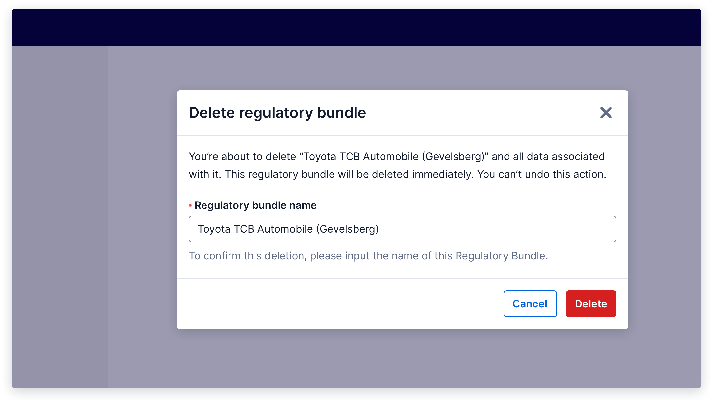

import {graphql} from 'gatsby';
import {Anchor} from '@twilio-paste/anchor';
import {Box} from '@twilio-paste/box';
import {Breadcrumb, BreadcrumbItem} from '../../../components/breadcrumb';
import {Callout, CalloutTitle, CalloutText} from '../../../components/callout';
import {Card} from '@twilio-paste/card';
import {Disclosure, DisclosureHeading, DisclosureContent} from '@twilio-paste/disclosure';
import {Grid, Column} from '@twilio-paste/grid';
import {Heading} from '@twilio-paste/heading';
import {Paragraph} from '@twilio-paste/paragraph';
import {Text} from '@twilio-paste/text';
import {useUID} from 'react-uid';

export const pageQuery = graphql`
  {
    mdx(fields: {slug: {eq: "/patterns/delete/"}}) {
      fileAbsolutePath
      frontmatter {
        slug
        title
      }
      headings {
        depth
        value
      }
    }
  }
`;

<content>

<Breadcrumb>
  <BreadcrumbItem to="/">Home</BreadcrumbItem>
  <BreadcrumbItem to="/patterns">Patterns</BreadcrumbItem>
</Breadcrumb>
<Heading as="h1" variant="heading10">
  {props.pageContext.frontmatter.title}
</Heading>
<Paragraph>{props.pageContext.frontmatter.description}</Paragraph>

<Box as="dl" display="flex">
  <Text as="dt" color="colorTextWeak" lineHeight="lineHeight30">
    <Box width="size10">Status</Box>
  </Text>
  <Text as="dd">beta</Text>
</Box>

</content>

---

<contentwrapper>

<PageAside data={props.data.mdx} />

<content>

## Ingredients

<Grid gutter="space30" marginBottom="space80">
  <Column>
    <Card>
      <Heading as="h3" variant="heading40" marginBottom="space0">
        <Anchor href="../components/card">Card</Anchor>
      </Heading>
    </Card>
  </Column>
  <Column>
    <Card>
      <Heading as="h3" variant="heading40" marginBottom="space0">
        <Anchor href="../components/heading">Heading</Anchor>
      </Heading>
    </Card>
  </Column>
  <Column>
    <Card>
      <Heading as="h3" variant="heading40" marginBottom="space0">
        <Anchor href="../components/paragraph">Paragraph</Anchor>
      </Heading>
    </Card>
  </Column>
</Grid>
<Grid gutter="space30" marginBottom="space80">
  <Column>
    <Card>
      <Heading as="h3" variant="heading40" marginBottom="space0">
        <Anchor href="../components/button">Button (optional)</Anchor>
      </Heading>
    </Card>
  </Column>
  <Column>
    <Card>
      <Heading as="h3" variant="heading40" marginBottom="space0">
        <Anchor href="../components/anchor">Anchor (optional)</Anchor>
      </Heading>
    </Card>
  </Column>
  <Column>
    <Card>
      <Heading as="h3" variant="heading40" marginBottom="space0">
        <Anchor href="../illustrations">Illustrations (optional)</Anchor>
      </Heading>
    </Card>
  </Column>
</Grid>

```jsx
// import all ingredients for the delete patterns
import {​Card} from '@twilio-paste/core/card';
import {Heading} from '@twilio-paste/core/heading';
import {Paragraph} from '@twilio-paste/core/paragraph';
import {Button} from '@twilio-paste/core/button';
import {​Anchor} from '@twilio-paste/core/anchor';
```

## Usage

### General

This pattern is used to explain to a customer what they should do next if content is either unavailable or can’t be displayed.

Empty states should:

- **Be clear:** If there’s a path forward, explain it as concisely as possible. Include an explanation for why a customer is seeing the empty state if it helps them better understand what to do next.
- **Give direction and educate the customer:** Let customers know what steps they can take to move forward in a flow. Guiding them to “Create an alpha sender” is more helpful than saying “No alpha senders”.
- **Be encouraging and inspire confidence:** Use a [friendly and approachable tone](/content/voice-and-tone#encouraging) to ensure a positive experience. Never make customers feel unsuccessful or guilty because they’re seeing an empty state. Even when they arrive at a page “in error” (for example, on a page they don’t have permissions to), encouraging messaging and an explanation of possible solutions can give customers confidence that they’re heading in the right direction.

In most cases, treat an empty state as an informational state of the entire page, and not a state that simply replaces a part of the page that should otherwise be populated. When you have text explaining what a page is for, try working it into the empty state card.

When a page is in an empty state, its call-to-action (CTA) should appear in the empty state card, not near the page heading like in the [Create pattern](/patterns/create/). Exceptions can be made in cases like some “No results found” scenarios, when a CTA is already on the page on load. The visually focus of hiding the CTA that’s outside of the card could draw too much of the customer’s attention away from their primary goal.

### Accessibility

For call-to-actions in an empty state, use an [Anchor](/components/anchor) if the action will take the user to a new URL.
In all other cases, use a [Button](/components/button). For detailed guidance on applying this recommendation,
check out the [Button vs. Anchor pattern](/patterns/button-vs-anchor).

## Variations

<Callout>
  <CalloutText>
    If you’d like to contribute guidelines for empty states in even more compact situations, like a navigation panel or
    components like Combobox, please reach out in a GitHub Discussion!
  </CalloutText>
</Callout>

### Empty state with an immediate next step

In most cases, empty states have a [Heading](/components/heading) summarizing what’s happening, a [Paragraph](/components/paragraph) that gives more detail to help a customer decide what to do next, and 1–2 calls-to-action.

<iframe
  src="https://codesandbox.io/embed/empty-states-with-immediate-next-steps-7tbp3?fontsize=14&hidenavigation=1&theme=dark&view=preview"
  style="width:100%; height:500px; border:0; border-radius: 4px; overflow:hidden;"
  title="Empty States with immediate next steps"
  allow="accelerometer; ambient-light-sensor; camera; encrypted-media; geolocation; gyroscope; hid; microphone; midi; payment; usb; vr; xr-spatial-tracking"
  sandbox="allow-forms allow-modals allow-popups allow-presentation allow-same-origin allow-scripts"
></iframe>

### Empty state requiring a customer to wait

A customer’s next step might not always require an immediate call-to-action. Instead, the best path forward for them might be to wait for another process to complete and come back later. This happens most often when a customer is awaiting data through event logs, or when another person or non-Twilio service needs to approve a customer’s request.

If the customer might need to start another workflow, consider giving them a way back to a dashboard or the start of another flow.

<iframe
  src="https://codesandbox.io/embed/empty-state-requiring-a-customer-to-wait-uyxu3?fontsize=14&hidenavigation=1&theme=dark&view=preview"
  style="width:100%; height:500px; border:0; border-radius: 4px; overflow:hidden;"
  title="Empty state requiring a customer to wait"
  allow="accelerometer; ambient-light-sensor; camera; encrypted-media; geolocation; gyroscope; hid; microphone; midi; payment; usb; vr; xr-spatial-tracking"
  sandbox="allow-forms allow-modals allow-popups allow-presentation allow-same-origin allow-scripts"
></iframe>

### Sizing & Responsiveness

When an empty state card is wider than 540px (recommended), use `padding="space150"`, and align illustrations horizontally with the text content.

In smaller spaces, use `padding=”space100”` and stack the illustration in the card above the text content.

If your empty state composition needs to accommodate different screen sizes, you can also wrap it in the Stack or Grid component.

<Box marginBottom="space80">
  <Disclosure variant="contained">
    <DisclosureHeading as="h5" variant="heading50">
      Show live example
    </DisclosureHeading>
    <DisclosureContent>Coming soon!</DisclosureContent>
  </Disclosure>
</Box>

### High-severity

A deletion is considered high-severity when the action cannot be undone, and it would be very time-consuming, or perhaps impossible, to recreate the deleted data. An action that deletes a large amount of data or has significant downstream impact would also be considered a high-severity deletion.

For high-severity deletions, show a confirmation modal that explains what is being deleted and the consequences of the deletion, and have the user manually confirm the deletion by typing the name of the object they are deleting.



<Box marginBottom="space80">
  <Disclosure variant="contained">
    <DisclosureHeading as="h5" variant="heading50">
      Show live example
    </DisclosureHeading>
    <DisclosureContent>Coming soon!</DisclosureContent>
  </Disclosure>
</Box>

## Post-deletion

After the user has deleted the object, navigate them to the index page, where they can see a list of all remaining objects, and show a success [Toast](../components/toast) informing them that the object has successfully been deleted. If it is possible to undo the deletion, give the user the option to do so, and tell them how long they have to undo the deletion if it is time-bound.

If the delete action fails, keep the modal open and display an error [Toast](../components/toast) that explains what went wrong and how to try again.

For more information, check out our [Notifications and Feedback patterns](/patterns/notifications).

## Starter kits

### CodeSandbox

Coming soon

### Figma

Coming soon

</content>

</contentwrapper>
