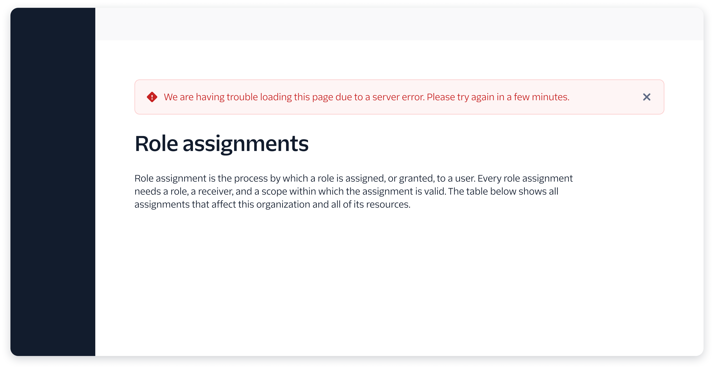
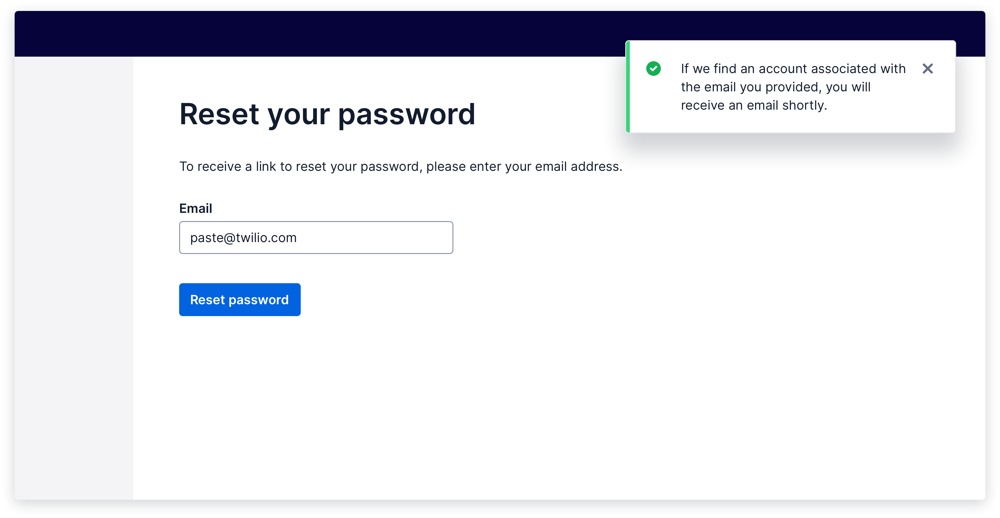

import {graphql} from 'gatsby';
import {Alert} from '@twilio-paste/alert';
import {Anchor} from '@twilio-paste/anchor';
import {Box} from '@twilio-paste/box';
import {Callout, CalloutTitle, CalloutText} from '../../../components/callout';
import {Card} from '@twilio-paste/card';
import {Disclosure, DisclosureHeading, DisclosureContent} from '@twilio-paste/disclosure';
import {Flex} from '@twilio-paste/flex';
import {Label} from '@twilio-paste/label';
import {Input} from '@twilio-paste/input';
import {HelpText} from '@twilio-paste/help-text';
import {Grid, Column} from '@twilio-paste/grid';
import {Heading} from '@twilio-paste/heading';
import {Paragraph} from '@twilio-paste/paragraph';
import {Stack} from '@twilio-paste/stack';
import {Tabs, TabList, Tab, TabPanels, TabPanel} from '@twilio-paste/tabs';
import {Text} from '@twilio-paste/text';
import {Toast} from '@twilio-paste/toast';
import {ErrorIcon} from '@twilio-paste/icons/esm/ErrorIcon';
import {SuccessIcon} from '@twilio-paste/icons/esm/SuccessIcon';

export const pageQuery = graphql`
  {
    mdx(frontmatter: {slug: {eq: "/patterns/notifications-and-feedback/"}}) {
      fileAbsolutePath
      frontmatter {
        slug
        title
      }
      headings {
        depth
        value
      }
    }
    allAirtable(filter: {data: {Feature: {eq: "Notifications and feedback"}}}) {
      edges {
        node {
          data {
            Documentation
            Figma
            Design_committee_review
            Engineer_committee_review
            Code
            status
            Product_suitability
          }
        }
      }
    }
  }
`;

<content>

<NormalizePatternHeader
  description={props.pageContext.frontmatter.description}
  name={props.pageContext.frontmatter.title}
  data={props.data}
/>

</content>

---

<contentwrapper>

<PageAside data={props.data.mdx} />

<content>

## Ingredients

Each notification or feedback pattern uses one or more of these components.

<Grid gutter="space30" marginBottom="space80">
  <Column>
    <Stack orientation="vertical" spacing="space50">
      <Card>
        <Heading as="h3" variant="heading40" marginBottom="space0">
          <Anchor href="/components/alert">Alert</Anchor>
        </Heading>
      </Card>
      <Card>
        <Heading as="h3" variant="heading40" marginBottom="space0">
          <Anchor href="/components/toast">Toast</Anchor>
        </Heading>
      </Card>
    </Stack>
  </Column>
  <Column>
    <Stack orientation="vertical" spacing="space50">
      <Card>
        <Heading as="h3" variant="heading40" marginBottom="space0">
          <Anchor href="/components/input/#input-with-inline-error">Inline error on form fields</Anchor>
        </Heading>
      </Card>
      <Card>
        <Heading as="h3" variant="heading40" marginBottom="space0">
          <Anchor href="/components/modal">Modal</Anchor>
        </Heading>
      </Card>
    </Stack>
  </Column>
  <Column>
    <Card>
      <Heading as="h3" variant="heading40">
        Component composition
      </Heading>
      <Paragraph marginBottom="space0">
        Create a composition with <Anchor href="/components/card">Card</Anchor>,{' '}
        <Anchor href="/components/heading">Heading</Anchor>, and <Anchor href="/components/paragraph">Paragraph</Anchor>{' '}
        for in-page messaging.
      </Paragraph>
    </Card>
  </Column>
</Grid>

```jsx
// import all components for Notification and feedback patterns

import {​ Alert } from "@twilio-paste/core/alert;
import { Toast } from "@twilio-paste/core/toast";
import { Label } from "@twilio-paste/core/label";
import { Input } from "@twilio-paste/core/input";
import { HelpText } from "@twilio-paste/core/help-text;
import {​ Button } from "@twilio-paste/core/button";
import { Modal, ModalBody, ModalFooter, ModalFooterActions, ModalHeader, ModalHeading } from "@twilio-paste/core/modal";
import {​ Card } from "@twilio-paste/core/card";
import {​ Heading } from "@twilio-paste/core/heading";
import {​ Paragraph } from "@twilio-paste/core/paragraph;
```

## Usage

### General usage

Pairing thoughtful content writing with the appropriate UI elements can help you establish trust with customers by notifying them of relevant information at just the right time. Use these patterns only when the user **needs** to be notified.

In general, notifications should close when a user leaves the page. A notification should follow a user through the product only in the most critical cases, like an alert informing a customer that their paid account won’t renew soon because of expired billing information.

Too many notifications that appear for too long may lead to alert fatigue, causing users to ignore important information.

There are 3 levels of notifications and feedback:

- **System-initiated notifications:** Information that’s not triggered by a user action and is related to system issues.
- **Feedback indicators:** Acknowledgment of a user action, like submitting a form or pressing a “Copy code” button.
- **Notification centers and reminders:** Currently, these are highly specific to products’ business needs and should be treated as a product feature, rather than a pattern. While the implementation of a notification center might use Paste components, guidelines specific to a notification center won’t be covered in this page.

<Callout>
  <CalloutTitle>Notifications in high-emotion or high-stress situations</CalloutTitle>
  <CalloutText>
    For high-emotion or high-stress parts of the customer journey, use a component that appropriately matches the
    customer's level of emotion. For example, to confirm that a customer has successfully upgraded their account, you
    may want to use a full-page confirmation that celebrates the moment, instead of a simple toast.
  </CalloutText>
</Callout>

Notifications and feedback can come in 4 variants:

- **Success:** Confirms a successful or completed action.
- **Error:** Communicates critical information that's actively preventing a user from continuing a flow.
- **Warning:** Communicates critical information that will help a user avoid a potential issue, but won’t prevent them from continuing their immediate goal.
- **Neutral:** Informs a user of general changes, or processes that have been triggered by a user action but will take time to finish.

### Accessibility

Give users enough time to read a notification message, make a decision, and act on their decision. Users’ reading speeds, vision levels, literacy levels, dexterity, and familiarity with Twilio products can all affect how much time they’ll need to interact with a notification.

Visit the [Alert](/components/alert), [Modal](/components/modal), [Form element](/components/input), and [Toast](/components/toast) pages for more specific guidelines on how to implement each component accessibly.

## Notification and feedback levels

### System-initiated notifications

To communicate information from the system that isn't triggered by a user action, use an **[alert](/components/alert)**, especially for high-priority or time-sensitive changes to the system.



<Box marginBottom="space80">
  <Disclosure variant="contained">
    <DisclosureHeading as="h4" variant="heading50">
      Show live example
    </DisclosureHeading>
    <DisclosureContent>TBD</DisclosureContent>
  </Disclosure>
</Box>

### Feedback indicators

To communicate feedback on a user action, use a **[toast](/components/toast)**, **[modal](/components/modal)**, **inline messaging**, and/or **in-page messaging** (e.g., full-page confirmation).

While you’ll only need one type of feedback indicator in most cases, pairing 2 feedback indicators can help give users more clarity in completing a complex flow. For example, when a user submits a long form with errors, you can show an error toast that lets users know they need to fix a form, while also showing inline errors on each incorrect field.

#### Standard feedback indicator (Toast)

Use a Toast when

- You’re communicating a direct response to a user action. Example: "asset.jpg" successfully added.
- You're providing only one link or button to help a user continue a flow.
- There’s no other way for a user to immediately know that their action was acknowledged. For example, a Toast may not be needed when a modal closes after a user presses “Save” in it. The modal dismissal may sufficiently communicate that the information in the modal was saved, without needing further messaging.



<Callout>
  <CalloutTitle>Toasts in Flex and SendGrid?</CalloutTitle>
  <CalloutText>
    While the recommendation is to migrate to Paste Toast components to acknowledge user actions, Flex and SendGrid
    currently use banners for this purpose.
  </CalloutText>
  <CalloutText>
    These banners generally exist at the top of the page, especially for page-level actions, with a limit of 3 per page.
    The oldest one is removed when a new one displays. In Flex, banners may be placed at the top of a specific section
    where the action was taken.
  </CalloutText>
</Callout>

#### Interruptive feedback indicator (Modal)

Use a Modal when

- You’re interrupting a user flow.
- You’re focusing a user’s attention and confirming a definitive action at the end of a Modal flow.
- You’re providing lengthy text, multiple links, or multiple buttons to help a user continue a flow.


<Box marginBottom="space80">
  <Disclosure variant="contained">
    <DisclosureHeading as="h5" variant="heading50">
      Show live example
    </DisclosureHeading>
    <DisclosureContent>TBD</DisclosureContent>
  </Disclosure>
</Box>

#### Contextual feedback indicator (Inline messaging)

Use contextual, inline messaging (e.g., inline errors on form fields) when

- You’re communicating a direct response to a user action.
- You’re providing links or buttons that are contextual to a UI element and help a user continue a flow.
- You’re communicating dynamically changing content, like a progress bar.


<Box marginBottom="space80">
  <Disclosure variant="contained">
    <DisclosureHeading as="h5" variant="heading50">
      Show live example
    </DisclosureHeading>
    <DisclosureContent>TBD</DisclosureContent>
  </Disclosure>
</Box>

#### High-emotion feedback indicator (In-page messaging)

Use in-page messaging (e.g., full-page confirmation composition) when

- You’re communicating a direct response to a _high-emotion_ user action or flow.
- You’re providing information that a user might want to copy, screenshot, or save, like a confirmation number or invoice details.


<Box marginBottom="space80">
  <Disclosure variant="contained">
    <DisclosureHeading as="h5" variant="heading50">
      Show live example
    </DisclosureHeading>
    <DisclosureContent>TBD</DisclosureContent>
  </Disclosure>
</Box>

## Starter kits

### CodeSandbox

Coming soon

### Figma

Coming soon

## Related discussions

- [Thoughts on expanded size variants for <Toast /\>](https://github.com/twilio-labs/paste/discussions/834)

</content>

</contentwrapper>
