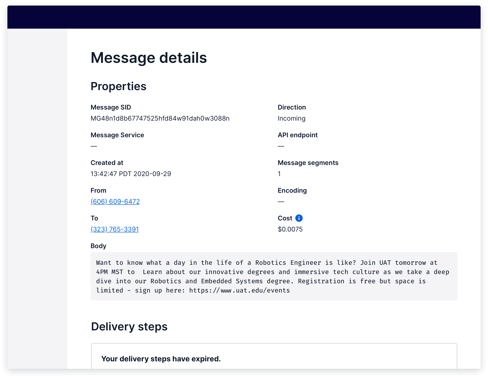
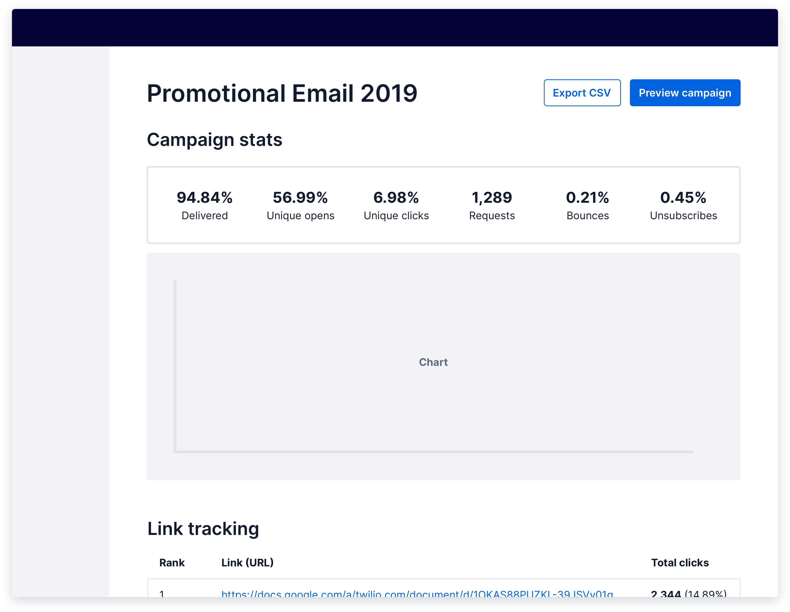

import {graphql} from 'gatsby';
import {Alert} from '@twilio-paste/alert';
import {Anchor} from '@twilio-paste/anchor';
import {Box} from '@twilio-paste/box';
import {Breadcrumb, BreadcrumbItem} from '../../../components/breadcrumb';
import {Callout, CalloutTitle, CalloutText} from '../../../components/callout';
import {Card} from '@twilio-paste/card';
import {Disclosure, DisclosureHeading, DisclosureContent} from '@twilio-paste/disclosure';
import {Flex} from '@twilio-paste/flex';
import {FormInput, FormLabel, FormHelpText} from '@twilio-paste/form';
import {Grid, Column} from '@twilio-paste/grid';
import {Heading} from '@twilio-paste/heading';
import {Paragraph} from '@twilio-paste/paragraph';
import {Stack} from '@twilio-paste/stack';
import {Text} from '@twilio-paste/text';

export const pageQuery = graphql`
  {
    mdx(fields: {slug: {eq: "/patterns/object-details/"}}) {
      fileAbsolutePath
      frontmatter {
        slug
        title
      }
      headings {
        depth
        value
      }
    }
  }
`;

<content>

<Breadcrumb>
  <BreadcrumbItem to="/">Home</BreadcrumbItem>
  <BreadcrumbItem to="/patterns">Patterns</BreadcrumbItem>
</Breadcrumb>
<Heading as="h1" variant="heading10">{props.pageContext.frontmatter.title}</Heading>
<Paragraph>{props.pageContext.frontmatter.description}</Paragraph>

<Box as="dl" display="flex">
  <Text as="dt" color="colorTextWeak" lineHeight="lineHeight30">
    <Box width="size10">
      Status
    </Box>
  </Text>
  <Text as="dd">
    alpha
  </Text>
</Box>

<Callout variant="warning">
  <CalloutTitle>This is an ALPHA pattern, and we need your feedback!</CalloutTitle>
  <CalloutText>
    If you have feedback or ideas on this particular pattern, please create a <Anchor href="https://github.com/twilio-labs/paste/discussions">GitHub Discussion</Anchor>. If you have feedback on the documentation of patterns as a whole, please <Anchor href="https://forms.gle/BzeekGGXd2uL6U7Z9">let us know</Anchor>. We need your feedback to make our patterns better!
  </CalloutText>
</Callout>

</content>

---

<contentwrapper>

<PageAside data={props.data.mdx} />

<content>

## Ingredients

<Grid gutter="space30" marginBottom="space80">
  <Column>
    <Stack orientation="vertical" spacing="space50">
      <Card>
        <Heading as="h3" variant="heading40" marginBottom="space0">
          <Anchor href="/components/heading">
            Heading
          </Anchor>
        </Heading>
      </Card>
      <Card>
        <Heading as="h3" variant="heading40" marginBottom="space0">
          <Anchor href="/components/tabs">
            Tabs
          </Anchor>
        </Heading>
      </Card>
      <Card>
        <Heading as="h3" variant="heading40" marginBottom="space0">
          <Anchor href="/primitives/text">
            Text
          </Anchor>
        </Heading>
      </Card>
    </Stack>
  </Column>
  <Column>
    <Stack orientation="vertical" spacing="space50">
      <Card>
        <Heading as="h3" variant="heading40" marginBottom="space0">
          <Anchor href="/primitives/box">
            Box
          </Anchor>
        </Heading>
      </Card>
      <Card>
        <Heading as="h3" variant="heading40" marginBottom="space0">
          <Anchor href="/layout/stack">
            Stack
          </Anchor>
        </Heading>
      </Card>
      <Card>
        <Heading as="h3" variant="heading40" marginBottom="space0">
          <Anchor href="/layout/grid">
            Grid
          </Anchor>
        </Heading>
      </Card>
    </Stack>
  </Column>
  <Column>
    <Card>
      <Heading as="h3" variant="heading40">
        Description list
        <br />
        (coming soon)
      </Heading>
      <Paragraph marginBottom="space0">
        Learn more{' '}
        <Anchor href="#standard-details">
          about description lists and how to compose them
        </Anchor>
        {' '}below.
      </Paragraph>
    </Card>
  </Column>
</Grid>

```jsx
// import all components for Object details patterns

import {
  Heading,
  Tabs, TabList, Tab, TabPanels, TabPanel,
  Text,
  Box,
  Stack,
  Grid, Column
} from '@twilio-paste/core';
```

## Usage

## General usage

An object details page or panel gives a customer a read-only view of their information, such as a message log or sent email.

Object details should:

- Be clearly separated into content sections with headings, and if necessary, tabs to allow a customer to easily scan for relevant information.
- Prioritize the order of content based on what customers find most important from customer research.


### Accessibility

A well-structured [document hierarchy](https://www.w3.org/WAI/tutorials/page-structure/) helps provide efficient in-page navigation for keyboard users, assistive technologies, and mobile web users.

Proper hierarchy allows users to skip directly to content that is most relevant to them. This is especially important on an object details page where there may be many  different types of information and customers are more likely to skim through.

To structure a page:

- Use headings to organize the page.
- Use headings in sequential order. For example, don’t place an H4 directly after an H2.
- Use description lists to define relationships between a property and its label.
- Use tables to organize data that are meant to be compared.

## Variations

### Standard details

The most common way to structure an object details page is to first show an overview of properties in a description list, followed by more detailed content sections. Properties should be left-aligned, and property labels and values should be vertically placed.

<Callout>
  <CalloutTitle>
    Composing a Description List
  </CalloutTitle>
  <CalloutText>
    <Paragraph>
      A list of properties should be structured into a description list using the{' '}
      <Anchor href="/primitives/box">
        Box
      </Anchor>
      {' '} and{' '}
      <Anchor href="/primitives/text">
        Text
      </Anchor>
      {' '}primitives (e.g.,{' '}
      <Text
        as="span"
        fontFamily="fontFamilyCode"
      >
        Box as="dl"
      </Text>
      ,{' '}
      <Text
        as="span"
        fontFamily="fontFamilyCode"
      >
        Text as="dd"
      </Text>
      ) to help define the relationship between a property and its label, and spaced with the{' '}
      <Anchor href="/layout/stack">
        Stack
      </Anchor>
      {' '}component.
    </Paragraph>
    <Paragraph>
      In the future, this composition will be replaced with a Description List component.{' '
      }
      <Anchor href="https://css-tricks.com/utilizing-the-underused-but-semantically-awesome-definition-list/" showExternal>
        Read more about description lists
      </Anchor>
    </Paragraph>
  </CalloutText>
</Callout>



<Box marginBottom="space80">
  <Disclosure variant="contained">
    <DisclosureHeading as="h4" variant="heading50">
      Show live example
    </DisclosureHeading>
    <DisclosureContent>
      TBD
    </DisclosureContent>
  </Disclosure>
</Box>

If there are more than 6 properties, divide the properties into 2 columns.

While this might be the most common structure for object details, use customer research to inform how to order the content sections on a details page. Show customers the most relevant information first.

For example, when viewing the details of a sent email campaign, a customer may want to quickly see how well their campaign has been performing over time. In this case, placing a group of stats cards and a chart first may be most appropriate.



<Box marginBottom="space80">
  <Disclosure variant="contained">
    <DisclosureHeading as="h4" variant="heading50">
      Show live example
    </DisclosureHeading>
    <DisclosureContent>
      TBD
    </DisclosureContent>
  </Disclosure>
</Box>

### Tabbed details

When you find that customers want to see multiple, top-level content sections, separate them with [Tabs](../components/tabs).


<Box marginBottom="space80">
  <Disclosure variant="contained">
    <DisclosureHeading as="h4" variant="heading50">
      Show live example
    </DisclosureHeading>
    <DisclosureContent>
      TBD
    </DisclosureContent>
  </Disclosure>
</Box>

## Starter kits

### CodeSandbox

Coming soon

### Sketch

Coming soon

## Related discussions

- [Label Value styling](https://github.com/twilio-labs/paste/discussions/528)

</content>

</contentwrapper>
