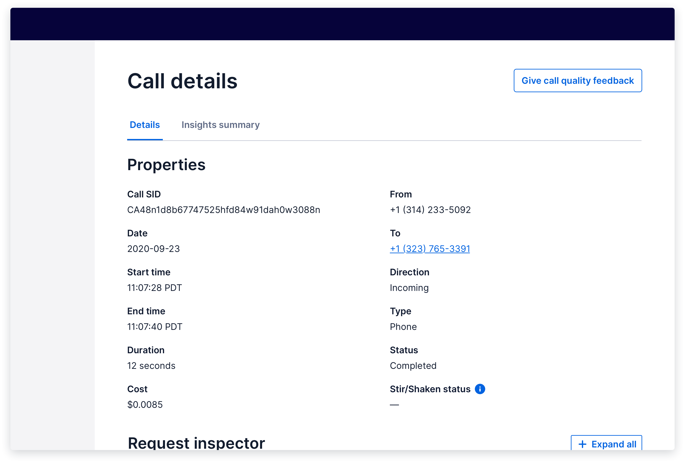

import {graphql} from 'gatsby';
import {Anchor} from '@twilio-paste/anchor';
import {Box} from '@twilio-paste/box';
import {Callout, CalloutTitle, CalloutText} from '../../../components/callout';
import {Card} from '@twilio-paste/card';
import {Disclosure, DisclosureHeading, DisclosureContent} from '@twilio-paste/disclosure';
import {Grid, Column} from '@twilio-paste/grid';
import {Heading} from '@twilio-paste/heading';
import {Paragraph} from '@twilio-paste/paragraph';
import {Stack} from '@twilio-paste/stack';
import {Text} from '@twilio-paste/text';

export const pageQuery = graphql`
  {
    mdx(frontmatter: {slug: {eq: "/patterns/object-details/"}}) {
      fileAbsolutePath
      frontmatter {
        slug
        title
      }
      headings {
        depth
        value
      }
    }
    allAirtable(filter: {data: {Feature: {eq: "Object details"}}}) {
      edges {
        node {
          data {
            Documentation
            Figma
            Design_committee_review
            Engineer_committee_review
            Code
            status
            Product_suitability
          }
        }
      }
    }
  }
`;

<content>

<NormalizePatternHeader
  description={props.pageContext.frontmatter.description}
  name={props.pageContext.frontmatter.title}
  data={props.data}
/>

</content>

---

<contentwrapper>

<PageAside data={props.data.mdx} />

<content>

## Ingredients

<Grid gutter="space30" marginBottom="space80">
  <Column>
    <Stack orientation="vertical" spacing="space50">
      <Card>
        <Heading as="h3" variant="heading40" marginBottom="space0">
          <Anchor href="/components/heading">Heading</Anchor>
        </Heading>
      </Card>
      <Card>
        <Heading as="h3" variant="heading40" marginBottom="space0">
          <Anchor href="/components/tabs">Tabs</Anchor>
        </Heading>
      </Card>
      <Card>
        <Heading as="h3" variant="heading40" marginBottom="space0">
          <Anchor href="/primitives/text">Text</Anchor>
        </Heading>
      </Card>
    </Stack>
  </Column>
  <Column>
    <Stack orientation="vertical" spacing="space50">
      <Card>
        <Heading as="h3" variant="heading40" marginBottom="space0">
          <Anchor href="/primitives/box">Box</Anchor>
        </Heading>
      </Card>
      <Card>
        <Heading as="h3" variant="heading40" marginBottom="space0">
          <Anchor href="/components/stack">Stack</Anchor>
        </Heading>
      </Card>
      <Card>
        <Heading as="h3" variant="heading40" marginBottom="space0">
          <Anchor href="/components/grid">Grid</Anchor>
        </Heading>
      </Card>
    </Stack>
  </Column>
  <Column>
    <Card>
      <Heading as="h3" variant="heading40">
        Description list
        <br />
        (coming soon)
      </Heading>
      <Paragraph marginBottom="space0">
        Learn more <Anchor href="#standard-details">about description lists and how to compose them</Anchor> below.
      </Paragraph>
    </Card>
  </Column>
</Grid>

```jsx
// import all components for Object details patterns

import {​ Heading } from "@twilio-paste/core/heading";
import { Tabs, TabList, Tab, TabPanels, TabPanel } from "@twilio-paste/core/tabs";
import {​ Text } from "@twilio-paste/core/text";
import { Box } from "@twilio-paste/core/box";
import { Stack } from "@twilio-paste/core/stack";
import { Grid, Column } from "@twilio-paste/core/grid";
```

## Usage

## General usage

An object details page or panel gives a customer a read-only view of their information, such as a message log or sent email.

Object details should:

- Be clearly separated into content sections with headings, and if necessary, tabs to allow a customer to easily scan for relevant information.
- Prioritize the order of content based on what customers find most important from customer research.

### Accessibility

A well-structured [document hierarchy](https://www.w3.org/WAI/tutorials/page-structure/) helps provide efficient in-page navigation for keyboard users, assistive technologies, and mobile web users.

Proper hierarchy allows users to skip directly to content that is most relevant to them. This is especially important on an object details page where there may be many different types of information and customers are more likely to skim through.

To structure a page:

- Use headings to organize the page.
- Use headings in sequential order. For example, don’t place an H4 directly after an H2.
- Use description lists to define relationships between a property and its label.
- Use tables to organize data that are meant to be compared.

## Variations

### Standard details

The most common way to structure an object details page is to first show an overview of properties in a description list, followed by more detailed content sections. Properties should be left-aligned, and property labels and values should be vertically placed.

<Callout>
  <CalloutTitle as="h4">Composing a Description List</CalloutTitle>
  <CalloutText>
    A list of properties should be structured into a description list using the{' '}
    <Anchor href="/primitives/box">Box</Anchor> and <Anchor href="/primitives/text">Text</Anchor> primitives (e.g.,{' '}
    <Text as="span" fontFamily="fontFamilyCode" color="currentColor">
      Box as="dl"
    </Text>
    , <Text as="span" fontFamily="fontFamilyCode" color="currentColor">
      w
    </Text>) to help define the relationship between a property and its label, and spaced with the <Anchor href="/components/stack">
      Stack
    </Anchor> component.
  </CalloutText>
  <CalloutText>
    In the future, this composition will be replaced with a Description List component.{' '}
    <Anchor
      href="https://css-tricks.com/utilizing-the-underused-but-semantically-awesome-definition-list/"
      showExternal
    >
      Read more about description lists
    </Anchor>
  </CalloutText>
</Callout>


<Box marginBottom="space80">
  <Disclosure variant="contained">
    <DisclosureHeading as="h4" variant="heading50">
      Show live example
    </DisclosureHeading>
    <DisclosureContent>TBD</DisclosureContent>
  </Disclosure>
</Box>

If there are more than 6 properties, divide the properties into 2 columns.

While this might be the most common structure for object details, use customer research to inform how to order the content sections on a details page. Show customers the most relevant information first.

For example, when viewing the details of a sent email campaign, a customer may want to quickly see how well their campaign has been performing over time. In this case, placing a group of stats cards and a chart first may be most appropriate.


<Box marginBottom="space80">
  <Disclosure variant="contained">
    <DisclosureHeading as="h4" variant="heading50">
      Show live example
    </DisclosureHeading>
    <DisclosureContent>TBD</DisclosureContent>
  </Disclosure>
</Box>

### Tabbed details

When you find that customers want to see multiple, top-level content sections, separate them with [Tabs](/components/tabs).



<Box marginBottom="space80">
  <Disclosure variant="contained">
    <DisclosureHeading as="h4" variant="heading50">
      Show live example
    </DisclosureHeading>
    <DisclosureContent>TBD</DisclosureContent>
  </Disclosure>
</Box>

### Placement of object actions

Many object detail pages also include a set of actions that can be performed on that object, such as editing or deleting.

<Callout>
  <CalloutTitle as="h4">This pattern is coming soon!</CalloutTitle>
  <CalloutText>
    We've not yet patternized this part of Object Details. If you need this for your current or upcoming work, please
    consider partnering with us to <Anchor href="/introduction/contributing/patterns">contribute it</Anchor>.
  </CalloutText>
</Callout>

## Starter kits

### CodeSandbox

Coming soon

### Figma

Coming soon

## Related discussions

- [Label Value styling](https://github.com/twilio-labs/paste/discussions/528)

</content>

</contentwrapper>
